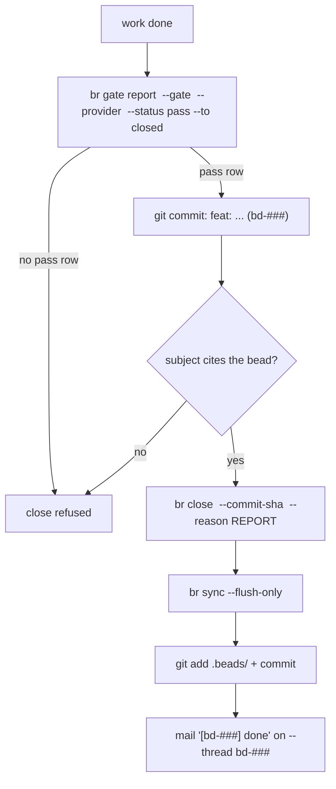

The close is where br earns "fail-closed". A close without a legal pass gate row and a `--commit-sha` is illegal. The sha is resolved and its commit message must cite the bead id; a sibling lane's commit, a beads-only commit, or an old HEAD fails loud. Verify before closing:

```bash
git show -s --format=%s <sha>     # must name your bead id
```

```text
$ git show -s --format=%s HEAD
chore(beads): drop Custom token from model comments and fixtures (bd-bqyb)
```

That subject cites its bead, which is what a resolved sha must do. `%s` is the
quick read; the close resolves `%B`, so a citation anywhere in the body counts
(a trailing `.` after the id is punctuation, but `bd-ab12.1` is not `bd-ab12`).

If it fails: a `%s` that names a sibling id, or none at all, will fail the close
with a citation error. Do not reach for a different sha — commit the work under
your own bead id first, then close on that commit.

Commits are attributed: export `AGENT_NAME` (your pin); unattributed commits fail closed even under a shared lease. A VERIFY fence holding one runnable command closes only via `command-verified`: state the commands you actually ran. The pre-commit guard adds a second net: bead-tagged hunks in a staged diff must appear in the commit message, and commits are attributed to a pin.

## The sequence



```bash
export AGENT_NAME="<your-pin>"
git commit -m "feat: add retry to uploader (bd-z2d0)"
SHA=$(git rev-parse HEAD)
br gate report <id> --gate live-verified --provider "$AGENT_NAME" --status pass --to closed \
  --note "sha=$SHA receipt=<path>"
br close <id> --commit-sha "$SHA" --reason "Implemented retry; commit $SHA; verdict live-verified; ran <VERIFY cmd> => <tail>; deviations: none; PRINCIPLES: prove-it-works — ran the fence"
br sync --flush-only
git add .beads/ && git commit -m "chore(beads): close <id>"
```

```text
$ br close
Error: Validation failed: commit-sha: --commit-sha <sha> is required to close (the commit message must cite the bead id); use --bypass-policy with BR_OPERATOR=1 to skip, which requires --bypass-reason

exit code 4
```

That refusal is the whole design in one line: no sha, no close — and the
`--bypass-policy` escape hatch is operator-only.

If it fails: the gate row goes AFTER the work commit, because its `--note` has to
carry `sha=<full 40-hex>` for `flywheel ledger check` to bind the verdict to a
revision. A note without that exact token reads unbound (clean-false) forever, and
a closed bead cannot be re-bound — the repair is `br reopen`, re-gate, re-close
citing the same work sha.

The workflow per bead decides which gates the close transition requires; `br gate list <id> --json` shows the required-gate status:

```text
$ br gate list beads_rust-5c02u --json
{
  "current_status": "in_progress",
  "gated_transitions": [ { "from": "in_progress", "to": "closed", "gates": [], "satisfied": true } ]
}
```

An empty `gates` array means this bead's transition names no required gate — and
the tool still refuses a silently unevidenced close, so record the verdict row you
actually earned (`live-verified`, `unit-test-verified`, `worker-receipt`,
`triage-verified`) rather than the one that looks strongest. A `command-verified`
row on a bead whose close does not accept it is recorded and then ignored: the
warning says `will not authorize the close`. Report only gates the workflow requires there; a gate name outside the list fails validation. When no gate is required, record the evidence row anyway (`br gate report --gate command-verified ... --status pass` without `--to closed`): the ledger keeps the receipt even when the transition is ungated.

Gate wrapper details: `flywheel ledger check` exits 0 only on a legal verdict for the current sha; `flywheel ledger receipt` writes the receipt file. Workers never write verdicts directly.

## One report, two channels

The close is one report with two copies:

- `--reason`: durable, ledger-gated, the canonical record.
- `toron mail send --to captain --thread <id> --subject "[<id>] done"`: the captain's copy. The captain has no push channel; without this mail the close is invisible to whoever coordinates.

Same REPORT fields in both: status, commit sha, verdict, command + result tail, deviations, principles cited.

## Close-side gates elsewhere in the stack

| Gate | Enforced by |
|---|---|
| Pass row for the gates the workflow requires | `br close` |
| Sha must cite the bead | `br close` resolution |
| Bead-tagged diff hunks must appear in the commit message | pre-commit strict guard |
| Attributed commits | pre-commit strict guard (`AGENT_NAME`) |
| Catalog freshness | CI test against `toron catalog` |
| Reservation guard | pre-commit hook (`toron guard install`) |
| Presence-gated closes | `br doctor` flags closes from pins with no live arrival (P5); fix is the door retroactively plus a note in the close reason |

Anti-pattern, stated once: `br close <id> --reason "..."` with no gate row and no sha. Cold agents copy that shape from old transcripts and false-close. The legal path is always gate, work commit, close with that sha.

## Which verdict is legal

The gate engine enforces a verdict legality matrix (source: `src/verify.rs`), so the gate name is not free-form:

| Bead shape | Legal closing verdicts |
|---|---|
| P >= 2, blast Normal, VERIFY loop-runnable | `command-verified` only |
| P >= 2, blast Normal, VERIFY not loop-runnable | `worker-receipt`, `triage-verified`, `unit-test-verified`, or `live-verified` |
| P &lt;= 1, or blast High | `unit-test-verified` or `live-verified` only |
| P &lt;= 1, blast Normal, ordered by a human | `operator-directed` (the provider names the human) |
| Acceptance is judgment | `reviewer-signed` only |
| Any | never a FAIL row, never missing |

Two refusal rules bite docs and report beads especially: a **report close** (ADR-0005 §2) refuses `unit-test-verified` outright (there is no code under test, so the verdict would be a false witness), and `command-verified` is illegal at P &lt;= 1. `br close --force` still requires the gate row and the cited sha; force never waives evidence. `--suggest-next` attaches follow-up suggestions to the close.
