## States

```mermaid
stateDiagram-v2
    [*] --> open : create
    open --> in_progress : claim (assignee = herdr slug)
    in_progress --> in_progress : work; gate rows accumulate
    in_progress --> closed : gate pass + sha citing the bead
    open --> closed : same ceremony
    closed --> open : reopen
```



`ready`, `blocked`, and `deferred` are views over `open`, not separate states. `br ready` returns open, unblocked, not-deferred, and dispatchable. `br blocked` names the blockers. `br defer` schedules for later.

## Fields

| Field | Values |
|---|---|
| priority | 0 critical, 1 high, 2 medium (default), 3 low, 4 backlog |
| type | `task`, `bug`, `feature`, `epic`, `question`, `docs` |
| labels | free-form, comma-separated on create, `label add/remove` after |
| parent | epic linkage via `--parent` |
| verify | the single-line VERIFY command (`--verify '<cmd>'`) |
| principles | `--principle '<name> — <decision it changed>'` (repeatable) |

## Dispatchability

`ready` and `next` gate on both:

1. **VERIFY fence.** A `## VERIFY` heading plus exactly one fenced single-line command. Missing, multi-line, or empty means not ready, and the planner is mailed once on the bead thread.
2. **Principles (P&lt;=2).** `## PRINCIPLES` with one citation line per principle. A canonical name with no decision clause is a skip.

An empty ready set with open, unblocked beads is a diagnosis, not a mood: `No dispatchable issues — N bead(s) lack VERIFY ...`. `br next` degrades with the named reason when the top pick fails the gate.

Wave labels ride the label field (`wave-N`): flywheel's loop holds wave-N while any lower wave is open. Label-based, transitional, until the typed wave field ships.

## Claims and staleness

Agent claims go stale after about 2 hours without `updated_at` movement; human or unclear claims after about a business day. A live reservation, a recent comment, or dirty files in the same paths means the claim is still active.

Reclaim protocol: audit comment first, then claim. `br coordination status` diagnoses swarm coordination state without mutating claims:

```text
$ br coordination status --json
{
  "schema_version": "br.coordination.v1",
  "summary": { "total_claims": 0,
               "workspace": { "open": 0, "ready": 0, "in_progress": 0, "closed": 1049 },
               "stale_candidate": 0, "abandoned_likely": 0, "ambiguous": 0 },
  "claims": []
}
```

`br coordination` with no subcommand is a usage error — the verb is `status`.
Read `stale_candidate` before reclaiming: zero means nobody is holding something
you would be taking.

If it fails: `ambiguous` counts claims whose evidence points both ways; treat a
non-zero `ambiguous` as "mail the holder", not as permission to reclaim — a live
reservation, a recent comment, or dirty files in the same paths all mean the
claim is still active even when `updated_at` looks cold.

Toron down: claim with an explicit assignee, record the intended file scope in a bead comment, check `git status` plus `br list --status in_progress` for collisions, keep the scope minimal, and note the degraded coordination in the close reason.

## Bulk operations

```bash
br update --actor "$ACTOR" <id1> <id2> <id3> --priority 2 --add-label triage-reviewed --json
br comments add --actor "$ACTOR" <id> --message "note" --json
br defer <id> --until 2026-09-14
```

```text
$ br comments add --actor bangedorrunt beads_rust-5c02u \
    --message "guide rewrite in progress: capturing real output for quick-start and friends" --json
{"id":922,"issue_id":"beads_rust-5c02u","author":"bangedorrunt",
 "text":"guide rewrite in progress: capturing real output for quick-start and friends",
 "created_at":"2026-09-26T00:24:25Z"}
```

`br update` takes several ids in one call and prints one `Updated` line per row.
The comment verb is `br comments add` (plural verb, subcommand) — a bare
`br comment` errors instead of writing.

If it fails: `br comments add` needs `--message` (`-m`, alias `--content`); an
error naming the flag is not a permission problem. `br defer --until` takes a
date, and a deferred bead leaves `ready` but keeps its state — it is a view, not
a status change, so do not hunt for a `deferred` status to set by hand.
