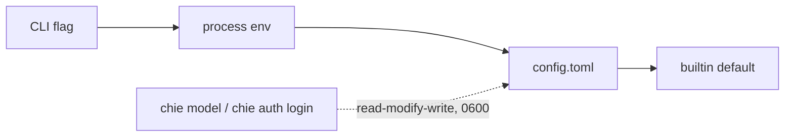

One file holds every setting: `$XDG_CONFIG_HOME/chiebukuro/config.toml` (default `~/.config/chiebukuro/config.toml`, on macOS too). `.env` files are not read at runtime (ADR-0037).

**Precedence:** CLI flag > process environment > `config.toml` > builtin default. Every TOML key maps to one environment variable; the file only fills variables that are not already set, so systemd `Environment=` and shell exports keep winning.



One file, and commands write it in place: `chie model <role> …` updates the route keys (`llm.model`, `memory.model` + `memory.provider`, `vision.model`, and their `*_fallback_model`), and `chie auth login <provider>` writes `[providers] <id>_api_key`. Both go through a comment-preserving read-modify-write, mode 0600, so your annotations survive. There is no second credential store: `auth.json` is retired (ADR-0046) and a leftover file is inert. The memory database is the exception and stays under the XDG *data* root, since it is data rather than configuration: `$XDG_DATA_HOME/chiebukuro/memory/memory.db`, else `~/.local/share/chiebukuro/memory/memory.db`, on every platform. A store left at the pre-XDG platform location (`~/Library/Application Support/chiebukuro/memory` on macOS) is moved there once, reported on stderr, and never read from the old location; `chie memory status --json` reports the path it actually used in `db_path`.

## Create

```bash
chie config init          # commented starter file, mode 0600
chie config path          # where it went
$EDITOR "$(chie config path)"
chie diagnostic           # confirm keys resolve
```

```text
$ chie config path
/Users/you/.config/chiebukuro/config.toml
```

Have an existing `.env`?

```bash
chie config migrate --dry-run     # redacted preview: typed keys vs [env] pass-through
chie config migrate               # writes config.toml; leaves .env for you to delete
```

```text
$ chie config migrate --dry-run
Sources:
  /Users/you/.env
Target: /Users/you/.config/chiebukuro/config.toml
Keys:   12 typed, 7 pass-through under [env]
  [env]: CONTEXT7_API_KEY, GOOGLE_GENERATIVE_AI_API_KEY, KIMI_API_KEY, OPENCODE_ZEN_API_KEY, QWEN_API_KEY, RESONATE_URL, TORON_MCP_URL

------------------------------------------------------------
connectors.twitter_auth_token = [REDACTED 40 chars]
env.CONTEXT7_API_KEY = [REDACTED 43 chars]
```

The dry run is where you find out what will be **typed** versus what lands under
`[env]`: a key with no matching TOML field is pass-through, which is how a
provider nothing reads keeps working after migration. `[REDACTED <n> chars]`
proves the key length without printing the value — the preview is safe to paste
into a report.

If it fails: a `--dry-run` that lists no sources means the `.env` path it looked
for does not exist — check the working directory you ran it from, since it reads
the nearest `.env`. Running `migrate` without the dry run first is how a
pass-through key becomes an `unknown key` warning later; the preview is the cheap
way to spot it.

## Revise

```bash
chie config show                  # parsed file, secrets masked, shadowed keys marked
chie config show --keys           # every TOML key → env var
chie config show --json           # machine-readable, includes load warnings
chie preflight --quick            # config file row: applied / shadowed / warnings
```

```text
$ chie config show
/Users/you/.config/chiebukuro/config.toml
------------------------------------------------------------
connectors.twitter_auth_token = [REDACTED 40 chars]  (shadowed by process env)
llm.context_window = 200000
llm.fallback_model = opencode-go/muse-spark-1.3-contributor
llm.model = zai/glm-4.5-air
memory.default_peer = user:you

$ chie config show --keys
config.toml key                              environment variable
--------------------------------------------------------------------------------
wiki_path                                    CHIEBUKURO_PATH
role                                         CHIEBUKURO_ROLE
llm.api_key                                  LAMBDA_RLM_API_KEY
```

The `(shadowed by process env)` suffix is the one line worth reading: the file
has a value and a live environment variable is overriding it, so editing the file
will not change behaviour. `--keys` is the map to search when the environment
variable name is not obvious (`llm.api_key` → `LAMBDA_RLM_API_KEY`).

If it fails: a key you set that never shows up is either unknown (warning at
startup) or spelled under `[env]`. `chie preflight --quick`'s Config file row
reports the count of applied versus shadowed keys in one line, which is the
fastest way to confirm the file is being read at all.

Rules of thumb:

- Unknown keys are warnings, printed once at startup. Fix or move them under `[env]`.
- `(shadowed by process env)` means a live environment variable overrides the file value. Unset it in the shell or systemd unit if the file should win.
- Arrays of strings become comma-joined env values (`gates = ["a","b"]` → `CHIEBUKURO_JEV_GATES=a,b`).
- Secrets: any key ending in `_key`, `token`, `secret` is masked by `show`, redacted from errors, and belongs only in this file (0600) or `chie auth` — never in the wiki tree or a memory record.

## Minimal working file

```toml
wiki_path = "~/workspace/notetoself"
role = "builder"                         # builder | consumer

[llm]
model = "zai/glm-4.5-air"
fallback_model = "deepseek/deepseek-chat"
max_concurrency = 5

[providers]
# zai_api_key = "…"                      # or: chie auth login zai
# deepseek_api_key = "…"
# firecrawl_api_key = "…"                # hosted OCR for scanned PDFs (optional)
# firecrawl_api_url = "…"                # self-hosted Parse deployment (rare)

[rlm]
max_turns = 50                           # default. Per-run override: --max-turns
token_budget = 200000                    # default 50000

[memory]
dual_write = true
llm = false
model = "zai/glm-4.5-air"
fallback_model = "google/gemini-2.5-flash-lite"
```

## Naming a model: `provider/model`

A model reference is either bare or provider-qualified:

| Form | Rides | Example |
|---|---|---|
| `glm-4.5-air` | the role's endpoint: its provider binding, else the registry-derived default | `llm.model = "glm-4.5-air"` |
| `zai/glm-4.5-air` | that provider's own base URL, key, **and protocol** | `llm.model = "zai/glm-4.5-air"` |

The part after the slash is the id sent to the API; the part before it never is. The prefix counts as a provider only when it matches a registry id — anything else keeps its slash and stays one literal model id, so `meta-llama/llama-3-70b` still works. `chie model` warns when a prefix looks like a typo.

| Provider id | Protocol | Base URL | Key |
|---|---|---|---|
| `opencode` | openai-compatible | `https://opencode.ai/zen/v1` | `OPENCODE_API_KEY` |
| `opencode-go` | openai-compatible | `https://opencode.ai/zen/go/v1` | `OPENCODE_GO_API_KEY` |
| `zai` | openai-compatible | `https://api.z.ai/api/coding/paas/v4` | `ZAI_API_KEY` |
| `deepseek` | openai-compatible | `https://api.deepseek.com/v1` | `DEEPSEEK_API_KEY` |
| `google` | openai-compatible | `https://generativelanguage.googleapis.com/v1beta/openai` | `GEMINI_API_KEY` |
| `anthropic` | anthropic | `https://api.anthropic.com/v1` | `ANTHROPIC_API_KEY` |

`google` is Gemini via its OpenAI-compatibility surface, so it needs no separate protocol; `gemini` is accepted as a prefix alias. Keys come from `chie auth login <id>`, the matching `[providers]` key, or the environment. A provider named without a key still resolves to *its own* endpoint: the failure is an auth error against the right URL, never a valid model name sent to the wrong gateway. The protocol comes from the provider too, so an `anthropic/...` model is dispatched to the Anthropic client even when `provider = "openai"` is set.

## Model roles and fallbacks

Every LLM-backed job runs under a role. Each role has a primary model and an optional **fallback model**, tried once when the primary fails with a non-retryable error (rejected or retired model id, malformed-for-this-model request, server error) or exhausts its retries. Fallbacks never chain.

Where the fallback runs depends on how it is written. Bare, it stays on the primary's endpoint, and an auth failure (`401/403`) or budget halt never triggers it — those would fail identically with any model. **Provider-qualified**, it moves to its own endpoint and key, and an auth rejection *does* trigger it: a dead key is conclusive for the provider that issued it and says nothing about a different one. Budget halts never fall back either way. This is the same single mechanism that replaced the old `llm.failover_*` gateway pair, which is gone (ADR-0040) — a cross-provider fallback expresses what it used to do, without a second config surface.

| Role | Used by | Model key | Fallback key | Default fallback |
|---|---|---|---|---|
| `primary` | extraction, synthesis, the RLM agent + analyst, anything without a narrower route | `llm.model` | `llm.fallback_model` | none |
| `memory` | derivation polish, summaries, dreamer, `chie memory chat` | `memory.model` | `memory.fallback_model` | `google/gemini-2.5-flash-lite` |
| `vision` | image description on ingest | `vision.model` | `vision.fallback_model` | `glm-4v` |
| `jev` | TypeSafe gates (ADR-0036) | `typesafe.model` | `typesafe.fallback_model` | `jev-latest` |

Three routes since ADR-0045 (which supersedes the nine-role surface of ADR-0038 and folds ADR-0041's two memory roles back under one binding). The former `extract`, `synth`, `rlm`, and `analyst` roles all ride `primary`; the memory plane's deriver and dialectic share `memory`, whose builtin fallback deliberately crosses to Google so the plane never shares a failure domain with the primary route. `vision` stays its own route because it is a capability boundary, not a preference. Old per-role keys for the folded roles are simply never read.

Resolution for both model and fallback: process env / `config.toml` > builtin. A `provider/model` prefix beats the role's `--provider` binding for that model only, so one role can hold models from two providers. Setting a fallback to the empty string disables it for that role; a fallback equal to the primary is ignored. `jev` is config-only: it is not a `chie model` role (its key and endpoint are separate), but `chie model --show` still lists it.

```bash
chie model --show                              # model, fallback, and both endpoints per role
chie model memory glm-4.5-air --fallback google/gemini-2.5-flash-lite
chie model primary zai/glm-4.5-air --fallback deepseek/deepseek-chat
chie model memory --fallback ""                # clear
chie model primary --provider opencode-go      # route rides another gateway
```

```text
$ chie model --show
role          model                        fallback                     endpoint (fallback endpoint)
--------------------------------------------------------------------------------------------------------------
primary       zai/glm-4.5-air              opencode-go/muse-spark-1.3-contributor https://api.z.ai/api/coding/paas/v4  ->  https://opencode.ai/zen/go/v1
memory        zai/glm-5.3-flash            google/gemini-2.5-flash-lite https://api.z.ai/api/coding/paas/v4  ->  https://generativelanguage.googleapis.com/v1beta/openai
vision        zai/glm-4.6v                 glm-4v                       https://api.z.ai/api/coding/paas/v4
jev           jev-1.13.0 (fallback: jev-latest)                https://api.typesafe.ai
```

Read the arrows: they are the two endpoints the fallback would move between, so a
provider-qualified fallback is visible before it ever fires. `jev` shows up here
even though it is config-only (not a `chie model` role).

If it fails: a `chie model` write that changes nothing usually lost to a process
environment variable — `chie config show` marks it `(shadowed by process env)`,
and `chie model --show` prints the effective route, not the file's. A fallback set
equal to the primary is dropped silently by design, so `--show` is the check.

When a fallback fires you get one stderr line: `[TEL] llm_model_fallback role=… from=… to=… reason=…`. If both fail, the error names both models. `chie preflight` reports fallbacks next to each probed model but only exercises the primary.

## Jev gates

```toml
[typesafe]
api_key = "…"
model = "jev-1.13.0"
fallback_model = "jev-latest"
gates = ["rerank", "rag_classify"]     # add ingest_triage, compile_faithfulness deliberately
[typesafe.thresholds]
rag_injection = 0.70
```

Gates are off unless listed. `rerank`, `rag_classify`, and `ingest_triage` skip on any failure; `compile_faithfulness` fails closed at `chie promote` (`--force` overrides). Details and thresholds: ADR-0036, `chie preflight`.

## Multi-host

Builder (mikasa) and consumer (eren) keep their own `config.toml`; only `role` needs to differ. A systemd drop-in `Environment=CHIEBUKURO_ROLE=consumer` also works and shadows the file. Nothing in `config.toml` syncs through the wiki tree.

## Troubleshooting

| Symptom | Check |
|---|---|
| Key set in file but "not set" error | `chie config show` — is it shadowed by an empty env var? `env \| grep CHIEBUKURO` |
| `unknown key` warning at startup | Typo, or a key not in `chie config show --keys`; move it under `[env]` |
| File ignored on macOS | `chie config path` must be under `~/.config`; `XDG_CONFIG_HOME` is honored for `config.toml`, and `XDG_DATA_HOME` for the memory DB, which is under `~/.local/share` rather than `~/Library/Application Support` |
| Model set but a different model is used | Process env wins over `chie model`: `env \| grep -E 'LAMBDA_RLM_MODEL\|CHIEBUKURO_MODEL'`. `chie model --show` prints the effective route |
| Fallback never fires | `chie model --show`; fallback equal to primary or set to `""` is dropped |
| Fallback fires too often | Fallback masks a broken primary; check `[TEL] llm_model_fallback` reasons and fix the primary route |
| `provider/model` treated as a literal model id | The prefix is not a registry id (typo, or an alias like `z.ai`). `chie model` warns; the known ids are above |
| A named provider always 401s | No key for it: `chie auth login <id>`, or set its key in `[providers]` |
| Scanned PDF fails with OCR error during compile | Set `FIRECRAWL_API_KEY` (optional, lifts rate limits) in `[providers]` or the environment; self-hosted Parse via `FIRECRAWL_API_URL` (ADR-0044) |
| `llm.failover_model` no longer does anything | Removed in ADR-0040. Write the fallback as `<provider>/<model>` instead |
| Daemon sees old values | Restart it; the file is read once per process |
