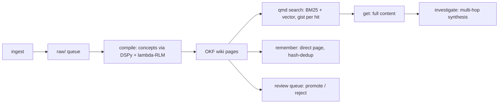
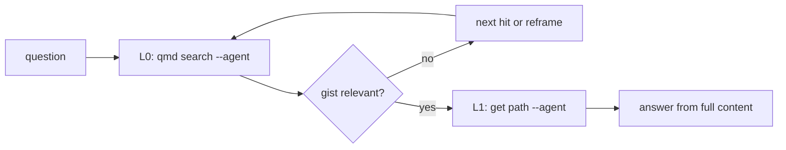

## Pipeline



- `ingest` files a URL or file into `raw/`. `queue` shows pending work; `inbox` processes inbox.md entries; `youtube` extracts dual subtitles.
- `compile` extracts concepts into OKF pages. `migrate-okf` is the one-time additive migration for older pages; `raw-normalize` cleans raw filenames.
- `qmd` (Rust) indexes markdown with BM25 + vector. Every hit carries a **gist**: about 350 characters from the OKF description or the first paragraph. Triage happens on gists; answers happen on full pages.
- `remember` saves durable knowledge directly as wiki pages with OKF frontmatter, deduplicated by content hash.

## The retrieval protocol (L0/L1)



Never answer from a gist alone. `chie sql --agent` is the metadata pass-through (counts, technical filters over FTS5/vector); `chie graph --json` maps relationships, communities, and gaps in the corpus.

## Promotion

Memory conclusions and compiled candidates reach the live wiki through the review queue:

```bash
chie memory promote --conclusion <id>   # explicit, reviewable (ADR-0033)
chie review list                        # inspect pending entries
chie review show <page>                 # one candidate in full
chie promote <page>                     # accept (PAGE is required)
chie reject <page>                      # refuse
```

```text
$ chie review list
Page                                      Score  Links        Age
----------------------------------------------------------------------
30313733-near-linear-scaling               1.00     11         1d
30353936-dynamic-model-routing-with-a-decision-model   1.00      9         0h
30383965-state-based-routing-and-launch-as-query   0.85      1         4h
```

`Score` is the reviewer's own ranking and `Links` is how connected the candidate
is; a low-score, zero-link page is the one to read before promoting.

If it fails: `chie review` with no action, and `chie promote` with no page, are
both usage errors — every verb here takes its target. `chie memory promote` is a
different surface with a different argument (`--conclusion <id>`), so a
conclusion never moves by passing its id to `chie promote`. A compile-faithfulness
gate failure blocks `chie promote` by design (`--force` overrides, deliberately).

## Routing

| Need | Tool |
|---|---|
| Curated knowledge | `chie qmd search --agent` |
| What was decided | `chie memory recall` |
| Both planes at once | `chie qmd search --memory` |
| Academic papers (150M+, arXiv/OpenAlex) | `paperclip search` |
| Who the user is | Honcho (identity, feeds `chie memory import-honcho`) |
| Live, current events | web search, only after wiki and paperclip return zero |
| Summarize N documents | `chie map --agent` |

Learnings live in per-project `docs/learnings/`; search them before planning, and compound verified work back into them. flywheel's compound gate (`ce-compound`) is the usual writer; chiebukuro is the index.
