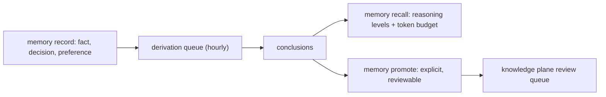

The memory plane answers "what happened, what did we decide". It is authority-distinct from the knowledge plane: conversational evidence, not curated truth.

## Lifecycle

- `record` appends and returns before derivation: writes never block.
- Derivation runs hourly; `repair` re-enqueues work an import or outage missed; `status` shows the queue.
- The **Dreamer** consolidates nightly (bounded, `--dry-run` capable); `memory dreamer` forces a pass.
- Promotion is the only path from conclusion to wiki page (ADR-0033). Never auto-promote.

## Commands

| Command | Latency | Role |
|---|---|---|
| `memory record` | &lt;1s | Append an event |
| `memory recall` | 1s; ~10s with the `rerank` gate | Episodic recall over peers/sessions/conclusions; a query searches the whole store (BM25-ranked, any-term fallback when no row carries every term, then a literal substring fallback), no query browses the recent window. With the `rerank` gate enabled, retrieval widens to `min(8 × --limit, 200)` rows, the gate reorders them, and the display limit still decides what is shown |
| `memory chat` | 5-30s | Natural-language recall, memory-only loadout |
| `memory status` | 1s | Beacon: totals, derivation queue, per-workspace Honcho imports |
| `memory promote` | 1s | Conclusion to review queue |
| `memory dreamer` | 30-120s | Force consolidation now |
| `memory repair` | 5-30s | Backfill missed derivation |

## Coverage discipline

For full coverage query both planes: knowledge for curated facts, memory for what was decided and why. `chie qmd search --memory` spans both in one call and labels the source of each hit, which is how an answer cites "wiki says" separately from "we concluded".

Session capture rides alongside: extensions record tool calls, debugging findings, and code decisions in real time (ADR-0028), and `chie sessions` mines those captures later. Honcho imports feed identity ("who the user is") into the memory plane via `chie memory import-honcho`; identity stays distinct from knowledge.

Rate limiting is handled for you: a global LLM semaphore with desynchronization jitter queues derivation and synthesis, so callers never hand-throttle.
