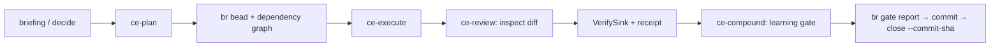

Compound Engineering contributes a work shape, not a second runtime. Its useful loop is: understand the problem, plan a bounded change, execute it, review the artifact, verify the result, and compound the lesson. Flywheel owns that loop; Toron supplies the durable engine and coordination; Beads supplies the work ledger and close gate.

## The local crosswalk

| Compound idea | Flywheel surface | Durable witness |
|---|---|---|
| Brainstorm and hold a goal | `ce-brainstorm`, briefing, `decide` | catalog row and goal inputs |
| Plan | `ce-plan`, `ce-plan-review` | bead IDs, acceptance, `dep_cycles=0` |
| Execute | `ce-execute`, wave dispatch | commit, receipt, Toron effect rows |
| Review | `ce-review` | findings with detection conditions and quoted evidence |
| Evaluate and verify | `ce-evaluate`, `verify`, repair paths | host contract verdict, VerifySink result, and receipt artifact |
| Compound | `ce-compound`, `docs/learnings/` | one learning or an explicit `clean_skip` |
| Refresh guidance | `ce-sweep` | keep/update/consolidate verdict and corpus diff |

The `ce-` names are stage vocabulary. They do not bypass the normal session door, crew proposal, workflow lint, effect journal, or Beads close ceremony.

## One work unit



### 1. Goal and plan

A plan is not a paragraph that sounds organized. The plan contract needs bead IDs, non-empty acceptance, and a runner-verified dependency check. The worker may propose `dep_cycles`, but only the runner's `br dep cycles --json` result counts.

### 2. Execute through the existing rails

Use `flywheel arrive`, then `flywheel briefing`, then its proposed argv. Dispatches carry the bead and stage. Toron owns reservations, build slots, mail, and effect intent/claim/settle. A worker cannot close its own work by writing a verdict: Beads receives the gate row first, then a commit carrying the bead ID, then `br close --commit-sha`.

Dry arms are honest previews. `workflow run` without `--execute` performs no external effect and therefore does not create a settled effect row. Live arms use the host-owned effect journal and refuse uncovered effect sinks.

### 3. Review the artifact, not the report

`ce-review` is report-only. A finding names an observable detection condition, severity, confidence, quoted evidence, and an autofix class. Two lenses in one pane are not independent witnesses. A settled captain decision can make a preference report-only, but a real defect inside a settled approach remains a defect.

Review occurs before the final verify gate. Every residual finding must be fixed in the diff or filed as a bead. A finding that exists only in scrollback is not durable evidence.

### 4. Evaluate and verify with the host

`ce-evaluate` is the fresh-context, read-only reviewer stage used by every repair iteration. It returns structured remaining work and validation evidence, but its `done` field is advisory. The following host `VerifySink` and phase contract decide pass or fail.

The workflow engine renders the verify command and invokes the embedding's `VerifySink`. The sink runs the command and writes a workflow receipt. The effect journal records the already-executed result around the sink; it never runs the command twice.

A `ship` chain additionally evaluates the phase contract between links. Each evaluation writes:

- schema and evaluator identity;
- run, workflow, link, and phase identity;
- pass/fail verdict derived by `phase_contracts`, never by worker status fields;
- redacted bounded input/output snapshots;
- SHA-256 of the complete redacted input/output values;
- the contract evidence string; and
- an integrity hash over the record.

The integrity hash detects mutation. It is not a signature and does not turn worker claims into trusted facts. Worker-authored `criterion_status: met` remains non-admitted until a trusted embedding calls `ArtifactRecord::admit()`.

Inspect a run's evidence with:

```bash
flywheel artifacts <run-id> --project <project> --json   # every record for the run
flywheel artifacts stitch <run-id> --project <project>   # per-record detail
```

```text
$ flywheel artifacts fw-composed-2026-09-25T23:14:49Z --project toron --json
[
  {
    "error": "flywheel: agent crew-toro09252314491b-reviewer not found in toron",
    "failed_step": "reviewer-ce-review-3",
    "leaf_preview": "{…elided…}",
    "status": "failed"
  }
]

$ flywheel artifacts stitch fw-composed-2026-09-25T23:14:49Z --project toron
/Users/you/Library/Application Support/flywheel/toron/artifacts/fw-composed-2026-09-25T23:14:49Z/stitched.md
```

That is a real record off a failed composed run: `failed_step` names the link,
`leaf_preview` carries the effect's own state (`effect_state: failed`), and
`status` is host-derived. The escaping in `leaf_preview` is literal — the leaf
serializes its own JSON into a string field.

If it fails: no records at all means the run never wrote an artifact dir (check
`flywheel runs list` for the run's state before reading the record). A composed
run that wrote only its outcome (`terminal.json`) stitches into
`No typed ArtifactRecord for this run.` plus a `## Non-artifact records` line
naming `status`, `failed_step` and the error, so an outcome-only run reads as
an outcome rather than a parse error. A missing evaluation artifact is itself a
failed gate: warn mode continues with `gate-warnings`, block mode stops at the
link.

### 5. Compound the learning

The compound gate asks three questions:

1. **Non-obvious:** would the reasoning be recoverable from the final code, tests, and comments?
2. **Durable:** is the result an invariant, root cause, rejected approach, or convention?
3. **Material:** would forgetting it cause recurrence or substantial rediscovery?

If all three hold, update an existing high-overlap entry or write one new project-scoped learning. If not, record `clean_skip`. The learning belongs in the same change as the work that produced it.

## What we intentionally did not copy

- No second workflow engine: Toron WorkflowEngine remains the execution rail.
- No vector retrieval requirement: `docs/learnings/` stays `rg`-able and Chie indexes it.
- No transport-owned commits: workers produce evidence; the operator/host owns commit and close.
- No new criteria file: stage contracts, project standing orders, and Beads acceptance remain the criteria homes.
- No prompt-only eval alias: an evaluation workflow without a real host witness would be theater.

## Refreshing parity

The current refs and adoption status live in [`../upstream-parity.toml`](../upstream-parity.toml). The manifest is checked offline by the Rust test suite. Refresh it after a release, then update the local surface and evidence paths before claiming parity.
