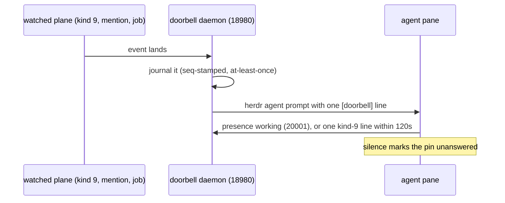

Nothing pushes into an agent's head; agents are woken. The doorbell follows the ADR-0016 effect-kernel boundary: observations become `Msg`, `doorbell-core::tick` returns commands, and `doorbell-rt` interprets them. Wake is plane D, owned by a dedicated daemon, not by spawn: `doorbell-core` is a pure tick reducer, `doorbell-rt` wires brain, sensors, and sinks, and the `doorbell` daemon listens on a UDS plus `127.0.0.1:18980`. Spawn records a subscription row and defers to a healthy daemon, starting one when `[doorbell]` is configured and none is running (`FLYWHEEL_NO_DOORBELL_ENSURE=1` opts out); only then does an embedded degraded mode run locally, with a WARNING naming the remediation. `flywheel kill` never touches the daemon.



## Honesty rules

The runtime brain is an interpreter and single writer, not a second policy engine. It must not invent presence, delivery, urgency, or success outside the pure model. Queue acceptance is not provider delivery; unknown and unroutable outcomes stay visible.

See [Functional effect kernel](./effect-kernel) for the reducer/interpreter laws.

- Wake stamps (`last_wake`) come only from real observations: herdr status or delivered prompt pins. Planned injects never forge them.
- One live workspace model per workspace; sends are doorbell-with-inbox; waiters park on `WaitCorr` until a receipt drains them (on ndjson and sweep).
- Budgets 5/30/3 are dispatcher-enforced.
- After `[doorbell]`, publish presence `working` or post one kind-9 line within 120 seconds, or the pin is `unanswered`.
- Journals (v2, rotated, seq-stamped) and subscriptions persist, so pending wakes survive crashes at-least-once.
- `flywheel doorbell why <project> <pin> --seq <n> --corr <id>` folds the tick from default and explains a named wake.


## Sensor→Msg edges (vocabulary only)

GS-045 P1-4 / ADR-0027–0028: sensors are **Msg producers**, not a GenServer
module. The live edges that feed `workspace::tick` (and the doorbell plane) are:

| Sensor edge | Msg arm | Role |
|-------------|---------|------|
| **WatchNdjson** | `Msg::WatchNdjson` | Room/kind-9 / job / reservation wire lines |
| **Herdr** | `Msg::HerdrStatus` | Pane status observations (feeds presence verdict) |
| **AckSla** | `Msg::AckSlaTick` | Ack SLA clock payload (clock enters as Msg only) |
| **InboxSweep** | `Msg::InboxItems` / `Msg::InboxRows` / `FetchInbox` Cmd | Mail inbox drain → classified wakes |

**Presence is not a Sensor GenServer and not a primary sensor Msg arm.**
Reachability / injectable|busy|dead is derived via **Herdr status + roles**
(and the trusted dispatcher-internal `Msg::Presence` edge for jsonl-timeout
paths). Do not invent a `PresencePoll` sensor module or a second presence
oracle beside `Model.presence`.

There is **no** `Sensor` OTP/GenServer module — adapters emit Msg; the pure
tick owns transitions; the effect layer applies Cmds. Do not invent a second
sensor bus.


## Hosting (how a subscription becomes a wake)

Subscriptions alone wake nothing — a hosted loop does. The daemon hosts a
Brain loop per `(project, workspace)` from two sources: boot `--host p/w`
pairs (baked into the launchd/systemd unit, so reboots keep them) and
auto-host: every 60s the daemon hosts every subscribed pair it can name
(lease-fenced — it never steals a live writer) and reaps spawn-scoped rows
silent for 7 days. `standby` with zero subscriptions is the only quiet
state; `standby_with_known_workspaces` is degraded and names the arming
verb. `flywheel kill` drops its spawn's rows (lifecycle symmetry);
operator rows outlive swarms. After `doorbell install`, reload the unit
definition (`bootout` + `bootstrap`) or the reboot runs the old hosts.

**A subscription buys you the sweep and an address — not a route.** The
hosted loop unions subscribed identities into the pin set it sweeps and
addresses, so a subscribed pin that was never spawned in the project (the
operator pin is the live case) has its inbox fetched and its mail
classified and journaled like anyone else's.

What a subscription row cannot create is a **pane**: rows carry identity,
scope, filter, sink, and budget — no target. Routing is registry-driven, and
deliberately so: inventing a target for a pane-less pin would fabricate a
delivery the sink cannot perform.

So the index marks such a pin **unroutable**, and its wakes are
**digest-bound**: they never enter the per-pin prompt queue (that queue only
drains on a `working → injectable` status transition, which a pin with no
pane can never produce — a queued wake there would be a RAM-only entry that
dies with the daemon and never reaches you). Instead the wake lands in the
digest batch, and the journal row says why:

```json
{"actions":[{"Digest":{"pin":"QuietHeron","why":"no_route"}}]}
```

Read it with `flywheel doorbell digest <project> --identity <pin>` — the verb
prints the wake line for a `Digest` row, which is the only place it is
rendered (the wake is otherwise readable only by grepping the journal).

`flywheel doorbell why <project> <pin>` replays these rows: `why` honors
the journal's `pins` attribution for daemon `InboxFetched`/digest rows (which
carry no `workspace::Msg`), so a daemon inbox wake shows with a `[journaled]`
label instead of reporting that nothing mentions the pin (bd-2i96; live-proven
2026-09-21). The label is honesty, not a fold: the row is journal evidence,
not a refolded reducer pass.

To get an actual **prompt** for such a pin you need a real pane to route to
(bind a subscription to a spawned pin) — or a webhook subscription (below),
which gives a pane-less pin a real destination. Otherwise digest is the
delivery.

## Waking a human with zero swarm (webhook sink)

The herdr sink needs a pane, and a human operator pin normally has none. Point
the subscription at an HTTP endpoint instead — the endpoint *is* the human:

```bash
export DOORBELL_WEBHOOK_ALLOWLIST=127.0.0.1   # the daemon's egress allowlist (D6)
flywheel doorbell subscribe --workspace w1 --pin OperatorPin \
  --sink webhook --url http://127.0.0.1:18999/wake --project myproj
flywheel doorbell start myproj             # the adapter registers at host start
```

```text
subscribed: cli-w1-OperatorPin scope=One("w1") sink=webhook

$ flywheel doorbell subscriptions | grep OperatorPin
cli-w1-OperatorPin identity=Pin("OperatorPin") scope=One("w1") sink=Webhook
```

The row id is derived from scope + pin (`cli-<workspace>-<pin>`), so a repeat
subscribe rewrites the same row instead of stacking a second one — a second
`subscribe` for the same identity reported `subscribed:` again and the store
still held exactly one matching row. The same id is the handle for
`flywheel doorbell unsubscribe cli-w1-OperatorPin`. Adding `--extra <workspace>`
widens the one row instead of adding another: the scope comes back as
`Many(["w1", "w2"])`.

If it fails: a wake that never arrives is usually the allowlist, not the row.
Check the row first — `flywheel doorbell subscriptions | grep OperatorPin`
empty means the subscribe never landed. With the row present but no POST, the
host was not on `DOORBELL_WEBHOOK_ALLOWLIST`: the daemon refuses it at start and
the wake stays digest-visible (the refusal line above), which is fail-closed on
purpose — a wake with no reachable destination is never reported delivered.

What each part buys:

- **The endpoint is per-row** (identity × scope × sink × endpoint), so two
  subscribers can target two endpoints; the workspace's `main_sink` stays the
  fallback for every pin no row names.
- **The URL's port and path are used verbatim** — `http://host:18999/wake`
  dials 18999 and `POST /wake` (Phase 2 speaks plain HTTP; TLS terminates at
  your edge, so an `https://` URL still dials the port you wrote).
- **The host must be on the allowlist.** Without it the daemon registers
  nothing and says so at start:
  `webhook subscription &lt;id> (&lt;pin>) host not on DOORBELL_WEBHOOK_ALLOWLIST:
  refused (D6 egress), its wakes stay digest-visible`. That is the
  fail-closed direction: a wake with no destination is never reported
  delivered.
- **Digest is a batching route** — the default is 10 lines or 300s, so expect a
  single wake to arrive as one `POST` within five minutes, not instantly. A
  pane-less pin's wake is digest-bound by design (there is no pane to prompt).

Verify the live chain end to end with `bash scripts/e2e-doorbell-webhook.sh`:
it stands up a receiver, hosts a workspace whose only pin is subscribed but
pane-less, and asserts the `POST` arrives on the URL's own port and path with
the pin named — then that an off-allowlist endpoint receives nothing.

So when `why` says nothing about a pin, ask in this order: is the daemon
hosting (`/health`), can it exec its CLIs (`/health.binaries`), is the pin
in the sweep set (`since_by_pin` in `doorbell-wake-<ws>.json`), and is it
subscribed? The journal is the only surface that answers all four.

## What the daemon execs (CLI resolution)

The daemon shells out to `toron` (bus watch + inbox fetch) and `herdr`
(prompt sink). It is normally started by launchd/systemd, whose `PATH` is
`/usr/bin:/bin:/usr/sbin:/sbin` — neither tool is there, and a bare-name
spawn fails as an ordinary child death: the watcher respawns on the retry
gate forever and every inbox fetch audits `toron spawn/timeout failed`,
while `/health` still says `mode: hosted`.

So the daemon resolves both to an absolute path at startup, first hit wins:

1. `PATH`
2. `~/.cargo/bin`
3. `~/.local/bin`
4. beside its own binary (dev checkouts, co-install)
5. `~/.local/share/mise/shims` **last**

Shims go last on purpose: a mise shim is a dispatcher that must infer a
tool version from env and cwd, so under launchd it dies with
`mise ERROR No version is set for shim: toron` — a resolved-looking path
that cannot run. Set `DOORBELL_TORON_BIN` / `DOORBELL_HERDR_BIN` to pin an
explicit binary; an override is used verbatim. `doorbell serve` logs the
resolved pair on startup and `/health.binaries` reports it:

```json
"binaries": { "toron": "/Users/me/.cargo/bin/toron",
              "herdr": "/Users/me/.local/bin/herdr",
              "resolved": { "toron": true, "herdr": true } }
```

### Reading `/health.degraded`

The list is the answer to "why didn't I get woken?", read back from the
plane's own files rather than tracked in RAM, so it survives a restart:

| Value | Means |
|---|---|
| `cli_unresolved` | `toron`/`herdr` not found anywhere above — wakes will not be delivered |
| `inbox_fetch_failing` | an `inbox_error` audit row inside the last 120s: the sweep is failing |
| `watch_restart_loop` | more than ~2× the healthy watcher restart rate in 300s. A **quiet** watcher restarts by design (90s idle-exit + retry gate ≈ every 109s); a handful in five minutes is healthy, dozens is a loop |
| `journal_torn_tail` | the journal has a torn tail; folds stop at the gap |
| `standby_with_known_workspaces` | the daemon is hosting nothing while workspaces that expect rings exist — re-arm it |
| `no_injectable_panes` | the exact opposite of a bug: hosting, registry pins exist, and `herdr agent list` knows the panes of **none** of them. Wakes classify, queue, and digest, and no prompt can land — start agents (`herdr agent start`) or fix the stale registry |


### Reading `/health.wake`

GS-062 (PR #16) puts wake-pipe liveness on both operator doorbell `/health`
(`:18980`) and flywheel `serve` `/health`. The object is the same shape on
both surfaces:

```json
"wake": {
  "workspace": "flywheel-flywheel",
  "hosted": ["flywheel-flywheel", "other-ws"],
  "pipe": { "class": "Quiet", "last_heartbeat_ms": 1727000000123 },
  "last_event_ms": null,
  "last_heartbeat_ms": 1727000000123,
  "deaf_ceiling_ms": 60000
}
```

| Field | Meaning |
|---|---|
| `workspace` | Worst-of **winner** workspace (stamps match the class — not "first alive") |
| `hosted` | Hosted workspace labels the classifier considered (alive-first order on flywheel `serve`; in-memory hosts on operator doorbell) |
| `pipe` | Classified pipe health — see classes below |
| `last_event_ms` / `last_heartbeat_ms` | Absolute unix-ms stamps from the **winner** workspace only (`null` if never stamped). Event and heartbeat are **split**: files `watch-<ws>.event` and `watch-<ws>.hb` under state `doorbell/`. Never pass `max(event, hb)` into `last_event_ms` — that collapses Quiet into Live |
| `deaf_ceiling_ms` | Silence ceiling (default **60000**). Live/Quiet require a frame inside this window; past it → Deaf |

`pipe.class` (and class-specific fields inside `pipe`):

| Class | Means | Extra fields |
|---|---|---|
| `Live` | A recent **event** inside the ceiling | `last_event_ms` |
| `Quiet` | No recent event, but a **heartbeat** inside the ceiling proves the pipe is alive | `last_heartbeat_ms` |
| `Deaf` | A known stamp exists, but no frame of either kind inside the ceiling | `silent_for_ms` (measured age of the most recent frame — never a fabricated ceiling stand-in) |
| `NeverStamped` | Never observed either stamp — **unknown ≠ deaf** | _(none)_ |

**Worst-of aggregate.** Multi-hosted classification takes the **worst** pipe
across hosted workspaces (`NeverStamped` > `Deaf` > `Quiet` > `Live`), not
primary-only and not a max-merge of stamps then one classify (one Live would
mask another Deaf). Empty alive/hosted → `NeverStamped`.

**ADV-5 (operators).** The wake consumer stamps `.event` only after a
successful `try_send` of `Watch` onto the brain channel; a full channel does
**not** stamp a delivered-looking event. `Died` uses `blocking_send` so a
full channel cannot drop `restart_wake`. Heartbeats stamp `.hb` without a
brain send.

See toron `docs/guides/buzz-parity` (PR #6) for Buzz×mail parity SoT.

### Signal hygiene: the audit file must stay readable

Two live faults were *found* only by reading the plane's own files, and both
were buried under self-inflicted noise (gs-044):

- **Stale spawn-registry rows.** The registry is never garbage-collected, so
a dead fleet's pins live on forever (live: three pins on `w11:*` panes herdr
had long GC'd). The sweep fetched them every tick. A registry pin whose pane
is absent from `herdr pane list` now drops out of the sweep after a 120s
grace, with ONE `registry_pin_stale` audit row naming pin, pane, and grace.
A pane that reappears un-reaps it; an **empty** pane list means herdr did not
answer, so nothing is reaped on a transient failure. `/health.injection`
counts sweep-set pins only (reaped pins are excluded, bd-2i96), so the count
matches the pins actually costing a fetch per tick; the reap itself stays
visible as its `registry_pin_stale` audit row.
- **The ack-SLA beat.** `toron ack-sla` re-reports every corr still past SLA,
so a stale backlog re-fired the same wake every 60s (live: `count: 89`, 1440×
per day). The beat now fires on a **change** only: new overdue ids audit
`ack_sla_fired`, the backlog clearing audits `ack_sla_cleared`. A steady
backlog is one fact, not one row per minute.

### The prompt hop's precondition (`/health.injection`)

A wake reaching a pane needs an *injectable* pane: one typed `InjectGate`
(bd-zawk) unifies the herdr-status gate with the presence parse, so `blocked`
means exactly one thing everywhere — `blocked` + urgent injects, `blocked` +
routine digests with its reason, never a silent drop. Statuses come from
`herdr agent list` mapped through the spawn registry. When herdr knows no agent, no wake can ever be
injected — a property of the environment, not a doorbell bug — and it used
to be invisible: `mode: hosted, degraded: []` while nothing landed. `/health`
now counts it:

```json
"injection": { "pins": 3, "panes_seen": 0, "injectable": 0,
               "panes_missing": 3, "prompt_hop": "no_pane_in_herdr" }
```

`panes_seen` counts panes in **any** status on purpose: a fleet caught
mid-work (every pane `working`) is healthy — the durable queue holds the
wake and drains on the next `idle` — so only `panes_seen == 0` with
`pins > 0` degrades. `doorbell serve` also says it out loud when it starts
hosting:

```
doorbell serve: hosting flywheel/flywheel-flywheel — 3 pin(s), 0 pane(s) in herdr, 0 injectable now
doorbell serve: WARNING hosting flywheel/flywheel-flywheel — 3 pin(s) but herdr knows none of their
  panes: NO wake can be injected here (inbox wakes queue/digest instead). Start agents (`herdr agent start`)
  or fix the stale registry
```

## Commands

Verbs live in two places: `flywheel doorbell …` (the operator surface —
status/start/stop/re-inject/afk/digest/why/inject/subscribe) and the
`doorbell` binary itself (the daemon: start/stop/restart/status/install/
serve/migrate/ping).

| Need | Command |
|---|---|
| Lifecycle | `flywheel doorbell status\|start\|stop\|re-inject\|afk` |
| Why | `flywheel doorbell why <project> <pin> --seq <n> --corr <id>` |
| History | `flywheel doorbell digest` |
| Direct ring | `flywheel doorbell inject <project> <pin> "<line>"` (ratcheted, budgeted, digest-visible) |
| Subscriptions | `flywheel doorbell subscribe\|subscriptions\|unsubscribe` (`--project` names the auto-host pair and is required: a project-less row is refused loud, bd-zawk — it would never ring) |
| Cross-workspace | `flywheel doorbell subscribe --workspace wA --pin P --extra wB --project <slug>` (scope printed, never implicit; `--project` required) |
| Human wake (no pane) | `flywheel doorbell subscribe --sink webhook --url http://host:port/path` + `DOORBELL_WEBHOOK_ALLOWLIST=host` on the daemon (see above) |
| Always-on | `flywheel daemon start` (flywheel + doorbell daemons in one command); `doorbell install` persists across reboots (launchd/systemd, idempotent); `curl 127.0.0.1:18980/health` shows `mode`, `hosted`, `binaries`, `injection`, `degraded`, and `wake` (see Reading `/health.wake` above) |

Cross-project wake is a captain hold: `br hold --kind captain --corr external:<proj>:<bead> <your-bead>` rings once when the foreign bead closes; you still resolve the hold.

A foreign owner on port 18980 fails `doorbell start` loud ("answered by foreign owner, not child &lt;pid>"). That is a port conflict, not corruption: stop the foreign holder or relocate the daemon.
