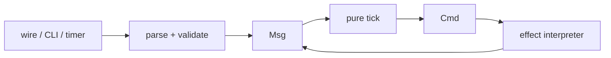

Observations enter as messages, reducers return commands, interpreters perform effects, and results come back as messages. On a remote command, fallback wraps the chain, the breaker sits inside the retry, the budget timeout wraps that chain, and the attempt timeout wraps only the call. An open breaker fails fast. Interruption is not a successful delivery and not `Unknown`.



## What belongs where

| Boundary | Owns | Must not own |
|---|---|---|
| Parser / adapter | untrusted input, compatibility decoding, authority sampling | policy transitions |
| Reducer | deterministic state transition and command choice | I/O, clocks, environment, locks, randomness |
| Interpreter | filesystem, process, network, clock, journal, sink calls | hidden model mutation |
| Persistence | snapshots, event rows, recovery projections | a second live policy engine |
| Jev | bounded advisory evidence | topology, commands, delivery, closure, settlement |

## The honest effect lifecycle

A real external effect is recorded before its provider runs:

```text
Prepared -> Claimed -> Running -> Delivered
                              -> Failed
                              -> Unknown
```

`Accepted` means a queue accepted work, not that a provider delivered it. `Unknown` is a useful outcome: it tells recovery and operators that the provider result cannot be proven. Dry runs perform no provider effect and therefore do not create settled effect rows.

## Authority injection

Host authority is resolved once at the process boundary. Effects receive paths, identity, configuration, clocks, process handles, and transports explicitly. Reducers receive time only through message payloads and wake policy through `WorkspacePolicy` model data. This makes breaker, timeout, retry, policy, and replay tests deterministic without sleeping or mutating process-global environment variables.

## Jev is not the controller

The deterministic routing table and code-owned thresholds remain authoritative. Jev can enrich a material-context request with bounded, redacted evidence. Its result returns as a message and is recorded as evidence. It cannot flip sticky-open, invent presence, settle delivery, close a bead, or turn an unknown result green.

See [Judgment packs](./judgment-packs) for pack validation and confidence rules.

## Typed boundary use

The kernel is an active boundary, not a marker module. Correlation IDs and agent pins are validated before workspace mutation, workflow names are validated before catalog lookup, project paths are validated before process adapters, and known failure phases use `kernel::ActionStage` rather than unchecked stage literals. `WorkspacePolicy` is loaded for both live models and replay folds, so configured thresholds cannot create a live/replay split. Stable wire output may remain string-shaped, but conversion belongs at the edge.

## Replay discipline

When adding a reducer arm:

1. add the message and command contract;
2. test the smallest transition and malformed input;
3. assert same input log gives the same model and command sequence;
4. test the interpreter boundary for timeout, retry, malformed response, and unknown;
5. verify crash/replay does not repeat a settled provider call;
6. run the focused test, then the full workspace and clippy gates.

The detailed laws and review checklist live in [effect-kernel discipline](../agent-instructions/effect-kernel).
