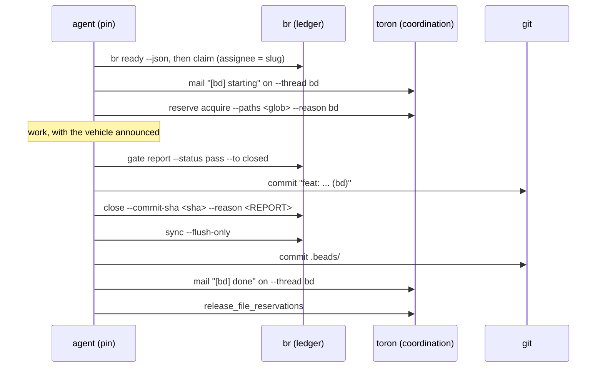
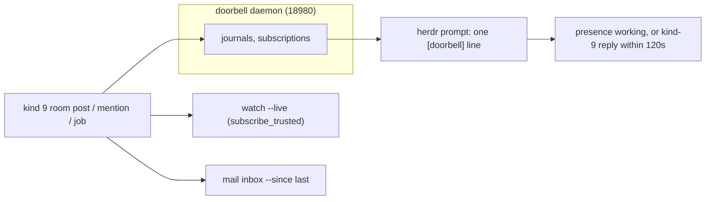

Each tool is useful alone. The stack is the loop: a bead is claimed, reserved, worked, gated, committed, closed, and mailed, with every hop carrying the same id.

## One work unit, end to end

The close is one report on two channels: the ledger-gated `--reason` and the captain's mail copy. Crew-to-crew handoffs skip the captain and run on plane S (channel + job 43001); file overlap is a reservation, never a DM.

## The protocol gates

Rules that held as tooling, failed as prose. Task size never waives them.

| Gate | Rule | Done when |
|---|---|---|
| **P0** skills | Load the owner of the work first: flywheel for orchestration, toron for mail/reservations, br for beads, chiebukuro for knowledge/memory. | Every command you run is owned by a loaded skill. |
| **P1** session door | `flywheel arrive`, then `flywheel briefing --json`, as the session's first action. | Both ran. Unarrived closes are flagged suspect by `br doctor`. |
| **P2** no self-routing | The briefing classifier picks the vehicle. | Its verdict is in your transcript and you execute its argv. |
| **P3** chokepoints shut | Fail-closed gates (pre-commit guard, close gate+sha, catalog freshness) pass on their own terms. | You never touch `TORON_GUARD_STRICT=0`, `--no-verify`, or prompt bypass strings. |
| **P4** bypass ledger | A broken, unavailable, or wrong gate passes only with a written record: the literal token `BYPASS`, the gate name, the reason. | One record per incident, filed before the next gated action. |
| **P5** exit needs entry | Closes, captain mail, syncs count only after P1+P2. | `br doctor` lists no unarrived closes. |
| **P6** operator waivers | Only the operator waives gates, verbally, logged verbatim. | Agents never waive for themselves or each other. |
| **P7** open is a vehicle | Open (current pane) tracks like everything else. | Before the second work unit: declare `vehicle: none (raw)` and file or claim a bead carrying the goal. |

A real bypass record, from bead `bd-z2d0`: `BYPASS gate=P2-briefing-classifier (proposed swarm/coalition-form). Reason: classifier cited file contention, world shows joinable=false, pins=0, zero held paths under docs/guides/**, preflight resonate DOWN. Vehicle: none (raw), tracked by this bead.` One incident, one record.

## The wake fabric

Nothing pushes to an agent; agents are woken or poll by design.

| Concern | Mechanism |
|---|---|
| Crew-visible broadcast | kind 9 room post, one line per post |
| Peer wake | doorbell dispatch (plane D), budgets 5/30/3 |
| Pull-based inbox | `toron mail inbox --since last` (atomic high-water) |
| Delivery proof | `channel post --wait-ack <secs>`; `channel read --author <pin>` |
| Correlated wait | `toron wait --corr <id>` (TTL-bounded, escalates wedges) |
| Cross-workspace | `doorbell subscribe --extra wB`; cross-project via `br hold --kind captain --corr external:...` |

## File-first deliverables

Findings longer than about 20 lines go to a durable file first; the post carries a summary plus the path (prefer toron `attachment_paths`). Redeliver from the file, never from scrollback. Dirt policy is permissive by design: only dirt under `source/`, `tests/`, `benches/`, `Cargo.toml`, `Cargo.lock`, and pinned toolchain files blocks a receipt. Tracker state (`.beads/`), orchestrator bookkeeping (`.flywheel/`), and editor artifacts never block.

## Degraded modes

| Symptom | Meaning | Move |
|---|---|---|
| `flywheel preflight`: resonate DOWN (127.0.0.1:8001 refused) | durable loop and compose engine degraded | `flywheel deps --ensure` starts it, or run open-vehicle work and say so |
| toron unreachable | no mail, no reservations | claim with explicit assignee, record file scope in a bead comment, check `git status` + `br list --status in_progress`, minimal scope, note it in the close reason |
| doorbell port held by a foreign owner | `doorbell start` fails loud | port conflict, not corruption: stop the foreign holder or relocate the daemon |
| no live fleet, stale reservations | briefing may read file contention | check `held_paths` holders; stale leases are visible in `toron list_file_reservations` |
| dispatcher absent, herdr socket up | panes can run but no flywheel supervision | `flywheel daemon start`; embedded doorbell degrades loudly |

## Where things live

| Path / port | Owner |
|---|---|
| `~/.config/flywheel/` | `config.toml`, `workflows/`, `crons/`, `profiles/`, `models/`, `policy/` |
| `~/.config/herdr/herdr.sock` | herdr socket |
| `<project>/.flywheel/agent-state/<name>.json` | per-agent context (git-ignored) |
| `~/.local/state/flywheel/` | flywheel loops, journals, runs, facts, doorbell state |
| `~/.local/state/toron/toron.pid` | toron pidfile (non-launchd hosts) |
| `127.0.0.1:18080` | toron daemon (MCP + mailbox) |
| `127.0.0.1:18081` | chiebukuro MCP (HTTP) |
| `127.0.0.1:18980` | doorbell daemon |
| `http://localhost:8001` | Resonate (durable execution) |
| `.beads/` | SQLite + `issues.jsonl` + `gates.jsonl` |
| `.flywheel/` | project stages + standing orders |
| `.toron/workflows/` | workflow YAML |
| `docs/learnings/` | compounded learnings (chiebukuro-indexed) |
| `docs/decisions/` | ADRs; consult before structural change |

## Landing the plane

Session completion, in order:

1. File follow-up beads for anything discovered but not done.
2. Run quality gates on changed code; docs changes run their own VERIFY fence.
3. Close finished work with the full ceremony (gate row, cited sha, sync).
4. `br sync --flush-only`, commit `.beads/`.
5. Hand off: the briefing of the next session should find no open decisions and no unread mail addressed to you.
