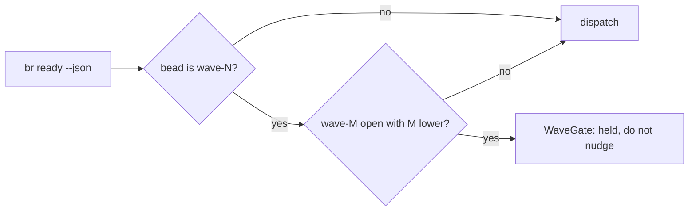

`flywheel loop-mode run <project> [--work]` is the runtime state machine. One live loop per project. Crash-resume is the same command; the durable loop self-heals.

`--work` polls `br ready`, claims and executes, watches claims, mails on T0-T3 blocks, and respawns agents on context exhaustion. Intervene only on blocked beads, bead floods, or idle-after-dispatch. A beadless `--work` loop resolves `complete` immediately: create lane beads first, or drop `--work`.

Run it from the parent workspace directory (`~/workspace`), not inside the repo, not with an absolute path; both fail later or in preflight.

## Dispatchability

`br ready` surfaces only dispatchable beads (see the beads repo lifecycle guide):

- `## VERIFY` heading plus exactly one fenced, single-line command. Missing, multi-line, or empty means not ready; the planner is mailed once on the bead thread.
- Priority &lt;= 2 requires `## PRINCIPLES`: one `<name> — <decision it changed>` line per principle, names from `flywheel principles list`.

Claim form: `br update <id> --status in_progress --assignee "<herdr-slug>"`. More than 3 ready beads at once trips the flood guard for one poll: a pause, not an error.

Dispatch briefs carry the bead header (`BEAD: <id>`) and the vehicle announcement. Crews restate the vehicle in their reports.

## Wave gates

Labels order the work. A bead labeled `wave-N` is held (`WaveGate`) while any `wave-M` with M &lt; N is open or in progress. Held is not stuck-owner: do not nudge it. No labels, no gating. `--no-wave-gates` disables the check, and the loop cannot reach `complete` while a bead is wave-held. `--wave-label wave-N` scopes dispatch to that label only (transitional until the typed wave field ships).

## The tick

The workspace doorbell is the same machinery at fleet scale (ADR-0027): one live workspace model owned by the doorbell loop, sends are doorbell-with-inbox, and correlated waiters park on `WaitCorr` until receipts drain them. Cron and timers are message producers, never a separate wake kind. `toron watch --live` plus `toron mail inbox --since last` collapse into one `[doorbell]` line per unit. The loop is bead dispatch; wake is the doorbell; neither requires the other to run.

## Fallbacks and recovery

- A fresh `loop-mode run --work` may park after the first poll: `resonate promises reject <id>`, then relaunch.
- `loop-mode run` verbs: `status`, `list`, `prune`, `doctor`, `replay`, `why`.
- Dead panes: `flywheel recover <project>` rebinds surviving panes or respawns dead ones. `flywheel rebind` only restores name bindings.
- Context over 80 percent: the loop auto-respawns; otherwise `kill --force-working`, then re-spawn.
- No flywheel swarm: `loop-mode run <slug>` from the parent cwd creates it.
