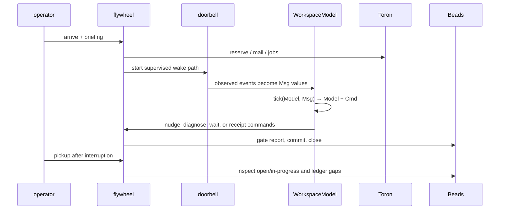

pstack's useful contribution is operational: make fast work follow a deep-first plan, make long-running work resumable, and make shipping depend on observable state instead of a confident handoff. Flywheel adopts those ideas as typed/cataloged operations rather than copying pstack's prompt files.

## Crosswalk

| pstack playbook | Flywheel equivalent | Stronger local boundary |
|---|---|---|
| `autonomous-run` | `autonomous-work` + durable loop | Beads ownership and close gates |
| `autopilot-stack` | loop-mode, doorbell, WorkspaceModel | pure Tick reducers and replay |
| `orchestrate` | briefing → compose/steer | classifier and crew budget proposal |
| `session-pickup` | `pickup`, `resume`, checkpoint | persisted loop state and ledger truth |
| `shipping` | `ship`, `ship-beads`, `commit-and-push` | gate row + bead-cited commit SHA |
| `eval` | phase contracts + evaluation artifacts | host-derived verdict and redacted hashes |
| setup budget | slots, profile routing, `--crew N` | strict provider/model registry |

## The long-running path



The Tick Law matters here. A poll result, clock value, or Herdr status becomes a message payload. Reducers do not read the clock, call I/O, mutate side maps, or silently drop a transition. The effect layer performs commands and feeds results back as messages. `doorbell why` can replay the journal because the decision lives in the reducer.

## Pickup and pause

`pickup` is an inspection-and-resume operation, not a new work allocator. It reads agent state, in-progress beads, ledger gaps, reservations, and last-sent markers. A resumed bead runs its VERIFY first; a green fence means the work is already done and should not be repeated.

`pause` checkpoints the current state and writes an exact handoff: in-flight beads, held paths, ledger gaps, and the resume command. It does not kill working panes unless `--force-working` is explicit. This prevents a friendly-looking pause from destroying work that has not reached its fence.

## Babysitting and shipping

`babysit-bead` drives one existing bead. It may nudge an unclaimed assignment, renew its reservation, or escalate a blocker. It never creates a new bead and never writes a verdict. `ship-beads` runs a predicate over the ledger: no ready beads, no unresolved claim-watch work, and all newly closed beads legal.

Shipping is not “the agent says done.” The close sequence is:

```text
br gate report <id> --status pass --to closed
commit with <id> in the message
br close <id> --commit-sha <full-sha>
br sync --flush-only
```

The SHA must bind to the work commit, not a bookkeeping-only `.beads/` or `.flywheel/` commit. A missing or unbound gate is a failed close, not a reason to weaken the gate.

## Evaluation without theater

pstack's eval playbook asks an evaluator to inspect surviving artifacts and transcripts. Flywheel has a narrower, stronger contract at the ship seam:

1. The worker returns a machine-readable phase report.
2. `phase_contracts` derives pass/fail from the report shape and external facts such as `br dep cycles`.
3. The host persists a bounded `EvaluationEvidence` artifact.
4. The artifact records redacted snapshots and hashes the complete redacted values.
5. The gate logs the artifact path and hash beside the phase verdict.
6. Failure to persist evidence fails the gate; warn-first only controls whether the chain continues.

The snapshot hash is an integrity check, not an authenticity proof. The evaluator identity and contract evidence explain who derived the verdict and why; neither permits worker JSON to self-admit.

## Budget and model routing

pstack asks for a budget before remapping effort. Flywheel exposes the same decision as operator-owned slots and crew budgets:

- `@cheap`, `@standard`, and `@premium` resolve through the model registry;
- `--crew N` means total panes, capped by the configured crew maximum;
- provider/model keys are composite and strict;
- fallback hops are journaled and bounded;
- non-interactive spawn-class proposals require explicit confirmation.

This keeps budget selection in the routing/catalog layer. It does not add an effort alias that can bypass provider capability checks.

## What parity means here

The checked-in manifest records three distinct outcomes:

- **adopted:** the local implementation has a durable code/test witness;
- **partial:** the concept exists, but semantics or automatic selection differ;
- **deferred:** no local claim is made.

A source version match does not prove behavioral parity. When upstream changes, update the ref, inspect the affected guide/playbook, classify the local status, and add or revise a witness path. Run the offline parity tests before using the manifest as a routing input.
