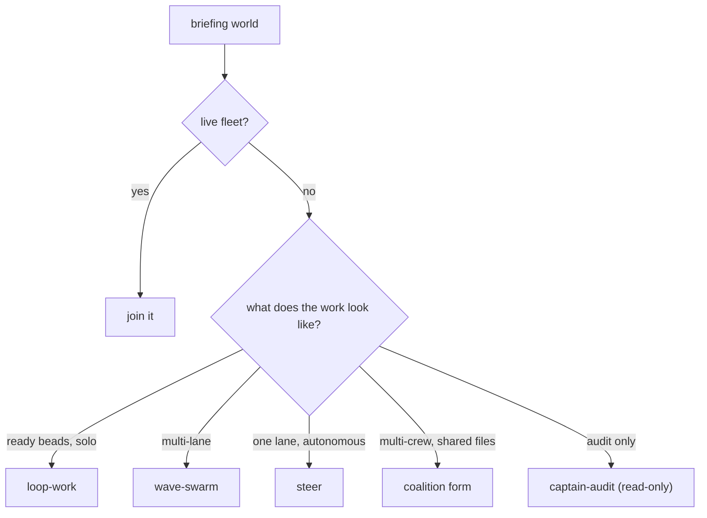

Every work session starts at the door, before code, plans, or state changes. Two commands, always:

```bash
flywheel arrive <project> --as <pin>
flywheel briefing "<goal>" --project <project> --json
# then run the proposal's argv (--commit / --yes accepts and executes)
```

Crews are proposals, not dispatches: after briefing, present the crew plan
(topology, roles, N, models) to the operator and accept a remix before
spawning. Non-TTY `briefing --commit` on a spawn-class topology refuses
without `--yes`; TTY asks inline. Cron/loop dispatch never routes through
briefing and is unattended by design.

If it fails: `arrive` is refused because the pin is not registered in this
project. Pins are per-project, so a pin that works in one repo misses in
another until it is registered there. Register it once and reuse the same
npub — `flywheel mail register <project> --name <pin> --from-project <other>`
— rather than minting a second key for a name that already exists. A second
key for a taken pin is a different identity wearing the same name, and the
whois resolution will not agree with the ledger.

## What arrive does

- Publishes presence (kind 20001) for the pin.
- Drains the `helm` report: open decisions, unread status, record divergence. Always printed, even when empty.
- Joins loudly if a fleet is live. A live fleet proposes join, never a second compose.
- Claims the captain alias first-come-first-served; never steal a live `whois.stale=false` holder.
- Arms the doorbell subscription: records `cli-<workspace>-<pin>` for the arriving pin on the stable project workspace, so zero-fleet sessions are woken with no further step (the daemon auto-hosts the pair within 60s).
## What briefing decides

`briefing` observes the world (joinable fleets, ready beads, held paths) and proposes exactly one topology with its argv. `flywheel decide "<target>" --json` is the classifier leaf inside briefing; the decision table lives in `src/decide.rs`.



Two hard rules:

1. Do not invent a second selector. The classifier picks: spawn, join, loop, or open.
2. Never decide "too small to dispatch" yourself. Executing the argv is the gate.

On a `steer` verdict for a multi-lane target: multi-lane is wave-swarm regardless. On `steer`/`loop-work`/`captain-audit`: run as-is, never compose around it, never force-fit a goal onto the read-only audit.

## When the verdict is wrong

A genuinely broken, unavailable, or wrong gate is passed only with a written record carrying the literal token `BYPASS`, the gate name, and the reason: a bead comment, memory record, or report line, one record per incident, filed before the next gated action. Example shape, from a real docs session:

```text
BYPASS gate=P2-briefing-classifier (proposed swarm/coalition-form). Reason: classifier cited
file contention, world shows joinable=false, pins=0, zero held paths under docs/guides/**,
preflight resonate DOWN. Vehicle: none (raw), tracked by this bead.
```

Only the operator waives gates. Agents pass wrong gates loudly or not at all. A close recorded without entry is flagged by `br doctor`; the fix is the door retroactively plus a note in the close reason.

## Announce the vehicle

Every dispatch carries its vehicle in the brief's first line: the stage name, the compose token (`wave-swarm`), or `none: raw`. Crews restate it in their reports. The trail records it (`flywheel timeline` shows `stage=`; compose runs write artifacts; "no artifacts" means no compose token ran).

Escaping a spawn (`--escape`) forfeits SIGNOFF and artifacts. If you escape, you write the trail: timeline entries and beads, or it does not exist.

Beyond the nine primitives above, `decide` also routes named playbooks to their builtins: `debate`, `brainstorm` (ce-brainstorm), bead-ready planning (ce-plan), the ship chain, `onboard`, `forensics`, `babysit-bead`, and `figure it out` (compose `--agent`: a planner authors the YAML, lint gates it). Each is still exactly one verdict with one argv.

## Mid-session material reclassify (GS-048+)

When context is material mid-session, do not reuse a stale first-prompt route. Run `flywheel reclassify "<goal>"` (or `decide --json` + `workflow list --brief` + `stage list`), announce `vehicle: …` / `none: raw`, and honor sticky-open. See [orchestration](../agent-instructions/orchestration.md#mid-session-reclassify-gs-048).
