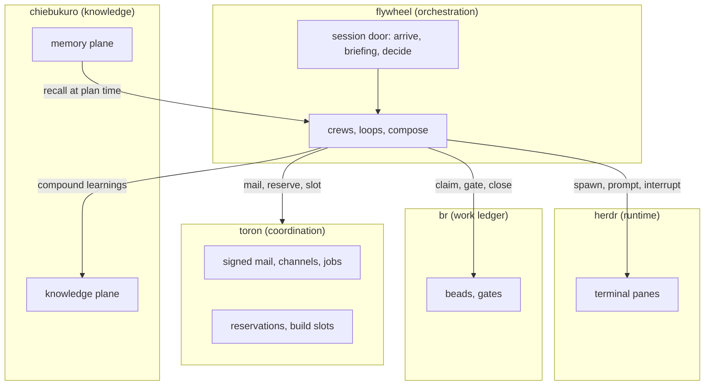

Four local-first tools turn a directory of terminal agents into a fleet that plans work, claims it, verifies it, and remembers what it learned. No server to rent, no database to provision.

| Tool | Owns | Binary |
|---|---|---|
| **flywheel** | Orchestration: session door, topology classification, spawn, durable loops, workflow compose, cron | `flywheel` |
| **toron** | Coordination: signed mail, channels, jobs, file reservations, build slots, receipts, durable workflows | `toron` |
| **br** | The work ledger: beads with dependencies, gate rows, fail-closed closes | `br` |
| **chiebukuro** | Knowledge and memory: compiled wiki (BM25 + vector), episodic memory, durable map-reduce | `chie` |

**herdr** is the runtime under all of it: a terminal multiplexer that keeps real panes running, classifies agent state (`working`, `blocked`, `idle`, `done`), and survives client detach. flywheel drives herdr panes. Nothing in this stack replaces it.

## How they fit



Dependencies run one way: flywheel depends on toron-workflow, toron-workflow on toron-core. br stands alone; the others address it but never embed it. chiebukuro stands alone.

## The shared key: the bead

One `bd-###` id joins all four tools. Work is real when the ledger says so; everything else points at the ledger.

| Artifact | Carries the bead id |
|---|---|
| br issue, gate rows, close reason | the ledger row itself |
| toron mail thread | `--thread bd-###` |
| toron file reservation | `--reason bd-###` |
| git work commit | `(bd-###)` in the subject line |
| flywheel dispatch | `BEAD: bd-###` header on every send |

## Start here, operator (once per host)

```bash
toron key generate --role operator
toron daemon install && toron daemon start
toron project ensure /path/to/project
flywheel toron setup-mcp --flywheel
flywheel deps
```

```text
key generated · role=operator · npub=npub1…  (secret not printed)
daemon installed · com.toron.serve
daemon started · 127.0.0.1:18080
project ensured · /path/to/project
mail (toron): idle
config: /Users/you/.config/flywheel/config.toml
```

If it fails: a `DRIFT` line rather than `idle` means flywheel and an installed
harness disagree about a flag or agent name. `deps --ensure` installs what is
missing but deliberately cannot resolve drift, because drift needs a decision
about which side is right. The `WARNING` names the function to update.

## Start here, agent (every session)

```bash
export AGENT_NAME=ToronScribe   # your pin; register once with: toron agent bootstrap --project <slug> --as <pin>
flywheel arrive <project> --as "$AGENT_NAME"
flywheel briefing "<goal>" --project <project> --json   # then run its argv
```

```text
ARRIVE  project=<project> dispatcher=absent pins=0 (no live fleet — not joining)
UNREAD STATUS: all read — no mail owed, no unacked wakes, digest empty

{ "proposal": { "topology": "open", "argv": [] },
  "world": { "dispatcher": "absent", "pin_count": 1, "ready_beads": 0 } }
```

If it fails: `dispatcher` reads `present`, which means a fleet is already live.
A live fleet is a join, never a second compose — starting your own is how two
crews end up contending for the same files. `topology: none` with an empty
`argv` is also a legitimate result rather than an error: it means no catalog
route matched, so declare a trigger or author one with `compose --agent`.

The door is not ceremony. `arrive` publishes presence, drains the session-start report (open decisions, unread status, divergence), and claims the captain alias first-come-first-served. The briefing classifier picks the vehicle: open, loop, swarm, or coalition. You run what it returns. The rulebook and its bypass ledger are in [integration](./integration).

## Vocabulary

| Term | Meaning |
|---|---|
| **pin** | Your public name, adjective + noun (`ToronScribe`). Mail `--as`/`--to` take pins. br `--assignee` takes the herdr slug (`flywheel-toron-coder`). |
| **bead** | One unit of ledgered work. `bd-###`. |
| **corr** | Correlation id minted by the sender. `toron wait --corr` parks until the receipt lands. Never reuse the thread id. |
| **plane** | One toron wire surface: P private gift-wrap, S shared rooms, J jobs, N presence, W live watch. |
| **wave** | Ordering label on beads (`wave-N`). A wave stays held while any lower wave is open. |
| **stage** | A named prompt template. `send --stage ce-execute` dispatches it. |
| **compose token** | A `--parts` name that expands a compiled pipeline (`wave-swarm`, `repair-until-verified`, `beads-lifecycle`). |
| **gate** | A recorded pass row in br that a close requires. Fail-closed: no row, no close. |
| **VERIFY fence** | One fenced, single-line command in a bead: the command that proves the work. |
| **gist** | ~350-character summary attached to every chiebukuro search hit. Triage without fetching. |
| **conclusion** | A memory-plane statement. Not a wiki page until explicitly promoted. |

## Guides

Each project has its own page set, herdr-style: index, quick-start, mechanics, CLI reference, troubleshooting.

1. [flywheel](./flywheel): the door, the classifier, spawn and send, the doorbell, loops, workflows, fleet ops.
2. toron (toron repo, docs/guides): identity, planes, mail, channels and jobs, reservations, workflow engine, daemon ops.
3. beads (beads repo, docs/guides): lifecycle, dispatchability, the close ceremony, graph analysis.
4. chiebukuro (chiebukuro repo, docs/guides): knowledge plane, memory plane, retrieval protocol, health.
5. [integration](./integration): one work unit end to end, the protocol gates, degraded modes, landing the plane.
