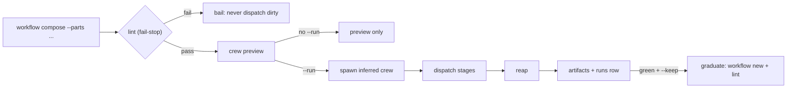

Three nouns, precisely: a **stage** is one named prompt (catalog: `stage list`). A **workflow** is an engine procedure, YAML steps or a graph. A **compose token** is a bare `--parts` name that expands a compiled workflow's steps inline, in one engine run, with one artifact trail. Stages referenced by spliced steps resolve from the stage catalog.

Ordinary builtins (`captain-audit` and friends) are not tokens: `workflow run <name> --execute` runs them. The `recipes` command is the legacy squad surface (spawn shapes), not compose; say "squad" for spawn shapes.

Every full `workflow list --json` row carries `description`, `family`, `selection`, `run` (the exact invocation), `compose_token`, and `decide_trigger`, so selection works like a skill catalog. Use `workflow list --brief --json` for the GS-052 **hybrid** projection (**name / family / selection / run / topology / compose_token**); use bare `workflow list --json` for description + decide_trigger + rest; use `workflow show <name>` for prose/graph detail (name/source/description/run/compose_token/trigger/guard/crew/inputs/steps/graph — **not** decide_trigger/family/selection/topology). The one-by-one review is in [workflow-catalog-review](./workflow-catalog-review).

## The --parts grammar

```bash
flywheel workflow compose "<target>" --parts wave-swarm --run --crew 3
flywheel workflow compose "<t>" --parts "role:coder:ce-execute" --parts "retry(2):each:lane" --run
```

```text
lint: ok · parts=2 · retry(2) wraps each:lane
crew inferred: coder:1
without --run this is a lint + preview only; no pane is spawned
```

If it fails: lint refuses and nothing dispatches. That is fail-stop by design —
a grammar-valid part can still be rejected for a real contract requirement, for
example `plan` without its declared input, `review` without a static fan-out, or
`implement` without an acceptance command. Fix the part rather than reaching for
a looser form.

| Form | Meaning |
|---|---|
| bare stage | dispatch that stage through its declared role |
| `stage:<stage>` | explicit spelling of a bare stage |
| `role:<role>:<stage>` | dispatch to the named agent role |
| `<role>:<stage>` | compact role form, kept for compatibility |
| `phase:<phase>:<stage>` | carry a lifecycle phase explicitly |
| `<phase>:<stage>` | compact phase form, where `<phase>` is one of `resolve`, `plan`, `implement`, `review`, `verify`, `compound` |
| `workflow:<name>` | splice a builtin's steps |
| compose token | expand `wave-swarm`, `repair-until-verified`, or `beads-lifecycle` |
| `each:<param>:<part>` / `parallel:<param>:<part>` / `when:<guard>:<part>` / `retry(n):<part>` | operators over another part |

Use the explicit `role:` and `phase:` forms when a role or phase name could be
confused with another vocabulary word. Phase lints still apply after parsing:
`plan` needs its declared input, `review` needs a static fan-out, and
`implement` needs an acceptance command. A grammar-valid part can therefore
still be refused by workflow lint for a real contract requirement.

`--base` seeds steps from an existing workflow. `--role-model ROLE=PROVIDER/MODEL` (repeatable) pins a role through the same strict registry as spawn. `--from-yaml` runs full YAML from a file or stdin.

## Tokens

| Token | Shape |
|---|---|
| `wave-swarm` | eight phases: GATE, DISPATCH, EXECUTE, OBSERVE, REVIEW, VERIFY, COMPOUND, SIGNOFF. REVIEW audits diffs pre-verify; COMPOUND captures learnings post-verify. Requires ready beads — beadless goals route to spawn-send, never here. |
| `repair-until-verified` | crew coder:1 + reviewer:1, uses fresh-context `ce-evaluate` before each VERIFY, and loops until the VERIFY fence passes, never auto-balloons. |
| `beads-lifecycle` | grill, create, review1, review2, integrate, implement, verify, outer SIGNOFF; nests builtins via `call_workflow`; `inputs.until` early-exits SUCCESS after any phase. After integrate, hand off to wave-swarm, never merge. |

Legacy alias: `workflow run <token> --execute` still runs tokens; the preferred door is `workflow compose --parts <token> --run`.

## Catalog overlays and coordination

`flywheel config seed` is the user-config door. It writes missing compiled-in
workflows, stages, and judgment packs into `~/.config/flywheel`, and writes
`config.toml` from `config.sample.toml` only when that file is absent.
`--overwrite none` (the default) does not replace an existing file.
`--overwrite stale` replaces a shipped file whose bytes differ, after a
`.bak` and a confirm. `--dry-run` prints the plan. `flywheel config drift`
only reports `missing`, `stale`, `current`, and `custom`. It does not write.
`workflow seed` is the same contract for workflows and stages alone.
Resolution stays built-ins, then the user directory. A project `.flywheel`
workflow or stage can still add a name the user tier does not have. A
judgment pack in the project directory does not replace the user pack.
See [workflow-catalog-review](./workflow-catalog-review).

Choose the control plane by handoff: `flywheel send` is captain → crew,
`toron channel` plus `toron job` is crew → crew, `toron mail` is private,
`flywheel steer` owns one captain-driven lane, and `workflow compose --parts`
owns an explicit multi-lane shape. Read back every load-bearing post; “sent”
alone is not delivery evidence.

## The YAML DSL

Schema fields: `name` (required), `description`, `trigger`, `guard` (an evalexpr with a 100ms timeout; false skips the steps), `inputs` (named; referenced as `{{inputs.x}}`), `crew` (`auto` or `{role: count}`), and either linear `steps` or a `graph` DAG built from `needs:` (lint rejects cycles).

Triggers (reactive; on-demand `run --execute` always works): `schedule`, `webhook`, `message_posted`, `reaction_added`, `reservation_acquired`, `reservation_released`, `agent_state_changed`.

Actions: `spawn` (the workhorse: `profile`, `stage`, `await`, per-step `harness` override, `no_claim_timeout` default 600s, `inputs`), `dispatch_job` (kind-43001), `send_message` / `send_dm`, `reduce` (bounded fold over a proper list: `all`/`any`/`count`/`sum`/`join`, one scalar), `request_approval` (durable suspend; approve and reject are kinds 46011 and 46012), `delay`, `park` (bd-ynef: durable wait until an ABSOLUTE `until_ms`; `max_wait_secs` is required and caps one wait; the intent is journaled before waiting so a crash resumes instead of losing the wait; the step value carries `parked` / `resumed` / `redrive_key`, and a park is interruption, not failure), `verify` (host `VerifySink` runs the command), `call_workflow` (sub-run; the child starts from the parent inputs, explicit keys win, outputs land under `{{steps.<name>}}`), plus control flow: `parallel` (fan out `over:` `@crew.<role>`, a positive integer, or a template that renders to one; success is a JSON array, any failed copy is `{ok:false}`), `branch`, `retry`, `foreach`, `loop` (`max` is a number or a template, cap 32; `until` stops on a true guard; a missing field is not yet; exhaustion is `{ok:false}`). A JSON object in a step `response`, or one fenced block, is copied onto the step so a guard can read `improved`. Two actions are **deprecated and fail-closed** (bd-i6kc): `react` and `call_webhook` are lint errors and the boundary rejects them with `unsupported_action`. Do not author them.

**`delay` vs `park`.** `delay { secs }` sleeps a relative span inside one process and dies with it. `park { until_ms, max_wait_secs, reason }` waits to an absolute wake time and survives a crash: the engine journals the intent before waiting, so a later run re-drives it under the same key. Reach for `park` when the wait must outlive the process — a busy-owner fence handing back "park until T" is exactly that case. Reach for `delay` when a plain in-run pause is enough.

A step fails when its value is `{ok:false}` or `{status:failed}`. `{skipped:true}` is not a failure. `repair-until-verified` is one `loop` (`max` from `inputs.max_iterations`, `until` on `steps_verify_ok == true`), not an unrolled `repair-1..3` graph. `hillclimb` is the same shape capped by `inputs.max_iters`, and it stops only when the reply JSON has `improved: true`.

Step policies: `on_error: continue` (default) or `fail_run` (the step's failure fails the run, kind-46012 `status=failed`); `await: true` blocks for the agent's result. Role conditioning is always on: every spawn and dispatch prompt is prepended with the profile's behavior preamble, which is how a role takes effect at runtime.

Execution modes: `--mode pane` (crew pre-spawned in herdr panes, bus-auditable, best for interactive work) and `--mode headless` (one-shot harness run, no panes, local, best for cron and short idempotent work). `--execute` opts into real dispatch; without it, `workflow run` records control flow only. A workflow is usable from open mode too: keep the current pane as the topology, and invoke a bounded workflow directly (`workflow run <name> --execute --mode headless`, or pane mode against an existing workspace); compose tokens remain explicit and do not silently spawn. Lint (fail-stop) checks graph acyclicity, stage and alias resolution, `@profile` resolution, required inputs, and guard syntax.

Session routing is continuous, not a first-prompt decision: on each new objective or material context change, inspect `workflow list --brief --json` and `stage list`, trigger the smallest matching workflow/stage, or explicitly choose `none: raw`. Re-run selection after each meaningful work unit when the task changes shape (bug-fix, review, verify, compound, or resume), while preserving the current topology unless the operator chooses loop/swarm.

Three gates validate the same closed action contracts: parse/normalize, lint, and invoke. Unknown fields, bad refs, invalid collections, and phase typos fail loud at the earliest gate; a valid template that renders an invalid runtime value is re-validated at invoke. Guards are explicit: a false guard is a skipped outcome with node identity, while a syntax/type/unresolved-ref error is a contract failure, never a silent false.

Lint passing is not a run. The **run ledger** records the truthful terminal status of a real run — `failed` / `blocked` / `suspended` / `succeeded` / `unknown`, with the real project and failure artifact paths. `workflow history` shows the recorded status and never defaults a missing row to `done` (a missing status reads `unknown`).

## Evaluation evidence

`ce-evaluate` is an advisory, fresh-context reviewer stage. It reads the actual artifact and VERIFY/ledger paths, returns structured findings, and never edits, closes, or self-admits. Host verification remains authoritative.

A `ship` chain persists one `EvaluationEvidence` record per phase under the parent run. The record includes the phase-contract verdict, redacted bounded snapshots, complete-value SHA-256 digests, evaluator identity, contract evidence, and an integrity hash. `artifacts stitch <run-id>` includes these records; a failure to persist one makes the phase gate fail, with warn mode continuing only as `gate-warnings`.

## Run lifecycle



`workflow run` without `--execute` records control flow only; no pane dispatches, and a `runs/` row can still show completed. `--mode` defaults to `headless`; `flywheel steer` is `--execute --mode pane`. Interactive TTY runs brief before dispatch (crew counts, model menus, stage chain, go/no-go) and a confirmed pane count mutates the spawn plan; `--json`, `--yes`, or an explicit `--crew N` skips it, and non-TTY is byte-identical.

Nested workflows use durable `ctx.run` children. The engine carries a serialized lineage envelope and refuses cycles, nesting beyond 8 workflows, or more than 32 child calls along one lineage branch before creating the child promise. This is an execution guard, not prompt guidance.

## Authoring and graduation

Ladder: `stage new`, `stage lint`, `stage promote`; `workflow new`, `workflow lint` (fail-stop), `workflow evaluate` (GS-049 evaluate-without-commit — validated partition candidates, no journal), promote. A same-named catalog file overrides a builtin; never edit the builtin. Ephemeral compose stays out of the catalog: `--keep <n>` graduates a green run through `workflow new` + lint. `--agent`-authored YAML is lint-gated: a failing lint bails before any dispatch.

Cron: `flywheel cron lint` then `flywheel cron start` owns recurring ticks. `cron run <name>` is a 25-second dry-run by default; `--live` force-fires once through the durable-loop runner. Cron YAML authoring mirrors workflow YAML; the P4.3 manager ticks off the registry.

After verified work, capture the learning once: `flywheel workflow run ce-compound --execute --inputs '{"source":"<what>"}'`. It files learnings into `docs/learnings/`, which chiebukuro indexes.

Binary freshness: compose tokens, new stages, and new flags resolve from the installed binary. After landing workflow-surface changes, rebuild (`mbx +nightly-aarch64-apple-darwin install --path . --force`) and verify from a non-repo cwd.
