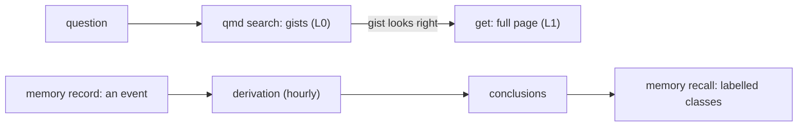

<Walk outcome={<>When you finish: you have read a full wiki page instead of a gist, written one page of your own into the knowledge plane, recorded a decision into the memory plane, and watched recall return it labelled as raw evidence rather than a conclusion. Those two labels are the point of the split, and they stay distinct on purpose.</>}>

## Two planes, one question

The knowledge plane holds curated pages that were compiled deliberately and, for compiled candidates, reviewed. The memory plane holds what happened: events recorded as work was done, derived later into conclusions. A conclusion is not a wiki page, and this guide never treats them as interchangeable.



Retrieval is two steps on purpose. A **gist** is roughly 350 characters and exists to help you choose a page; it is never the answer. Fetch the page before you answer.

<Step n={1} title="Know which wiki you are talking to">
```bash
chie status
```

```text
(｡◕‿◕｡) CHIEBUKURO STATUS
  Knowledge base path │ /Users/you/workspace/notetoself
  Raw sources      │ 275
  Knowledge base pages │ 8436
  Candidates       │ 242
  Stale pages      │ 1701 (>90 days)
  Tracked hashes   │ 377
```

Your path and counts differ. `Knowledge base path` is the directory every later step writes to and reads from.

<Fail>`Knowledge base path` is not the corpus you expected. Every step after this one would then be answering from the wrong wiki, so settle it here: `chie config` prints the file and the keys in force, and `chie diagnostic` adds per-subsystem PASS rows plus the credentials section (masked prefixes and lengths, never the value).</Fail>
</Step>

<Step n={2} title="Scan gists to choose a page">
```bash
chie qmd search "bounded iteration anti-spin controls" -n 3 --agent
```

```text
== reranked by jev (jev-1.13.0) ==
37623830-retry-limit | retry limit | 0.69 | jev 0.82
  gist: A maximum number of iterations set for the self-improving loop to prevent infinite retries and wasted computation.
  path: 37623830-retry-limit.md
… 2 more hits (trimmed here)
```

Every hit carries a `path` and a gist. Take the path to the next step, not the gist to your answer. `-n` clamps at 20 hits; `--rerank-jev` reorders the shortlist through a TypeSafe gate and is skipped with a note when no key is configured.

<Fail diagnose="chie qmd reindex">a page you wrote yourself does not appear in search. The search reads the qmd index, not the wiki directory, so a page can exist on disk and still be invisible here: `chie qmd reindex` rescans the collections, is incremental, and took under a second on an 8,000-page corpus. Long `ggml_metal_*` lines on stderr are backend init noise, not an error.</Fail>
</Step>

<Step n={3} title="Fetch the full page before answering">
```bash
chie get 37623830-retry-limit.md --agent
```

```text
---
type: concept
title: "retry limit"
description: "A maximum number of iterations set for the self-improving loop to prevent infinite retries and wasted computation."
kind: concept
sources:
  - raw/social/…md   (one source, trimmed here)
createdAt: "2026-07-13T10:09:31Z"
confidence: 0.82
provenanceState: merged
tags: [limitation, loop-configuration]
------

# retry limit
… body continues
```

The frontmatter is the page's own account of itself: `confidence` is the score it carries, and `provenanceState: merged` says the page was merged into the live wiki rather than captured raw. The body follows the `------` line, and this is the text an answer may cite.

<Fail diagnose="chie qmd reindex">`get` resolves through the same index as search, so a path that exists on disk can still come back as `no document matching` — a page written by `chie remember` is not indexed until its collection is rescanned. Pass the path exactly as the hit printed it, without a `sessions/` or `raw/` prefix.</Fail>
</Step>

<Step n={4} title="Write a page of your own">
```bash
chie remember "Never answer from a gist: scan, then fetch the full page." --kind gotcha
```

```text
[TEL] remember status=ok path=/Users/you/workspace/notetoself/sessions/remember-073c8d1d-never-answer-from-a-gist-scan-then-fetch-the-full-page.md hash=073c8d1d7439
Remembered to /Users/you/workspace/notetoself/sessions/remember-073c8d1d-never-answer-from-a-gist-scan-then-fetch-the-full-page.md
```

`--kind` labels the capture (`fact`, `insight`, `gotcha`, and so on). The page is written immediately and deduplicated by content hash, so recording the same sentence twice returns the same page instead of a second copy.

<Fail>The filename is slugged from the entire content, so a paragraph buys you a filename nobody will type. The corpus already carries the sharper version of this trap: past roughly 200 characters a write has failed with `File name too long` (os error 63), and the MCP `chie_remember` tool swallowed that error as an empty reply while the CLI printed it. Keep the content to one sentence and put detail in the page body, or `chie ingest` the source instead.</Fail>
</Step>

<Step n={5} title="Record what you decided">
```bash
chie memory record --agent --kind decision "Adopt the L0/L1 rule: gists choose the page, only full pages answer."
```

```text
Recorded memory event e-1c025ea9d563f7d3af27 (session manual-2026-09-26)
Derivation enqueued (1 pending in session).
```

The write returns before the derivation runs: `record` appends the event and exits, and conclusions are derived in the background. The event id is the durable handle, and it is what recall will show you.

<Fail>a record never becomes a conclusion. Derivation runs on a schedule and a worker has to be up to run it, so `chie memory status` is the read that says whether the queue is draining; `chie memory repair` re-enqueues derivation work from stored events when an import or an outage missed it.</Fail>
</Step>

<Step n={6} title="Recall it, labelled">
```bash
chie memory recall "gists choose the page, only full pages answer" --limit 5 --agent
```

```text
=== recall level: low (scope: global) ===
== memory_event (1 hit(s)) — raw what-happened evidence ==
- [2026-09-26 10:41] decision: Adopt the L0/L1 rule: gists choose the page, only full pages answer. [e-1c025ea9d563f7d3af27]
== conclusion (0 hit(s)) — derived memory, level/status tagged ==
== session_summary (0 hit(s)) ==
… a representation class for the peer follows
```

Read the classes rather than the list. Your event comes back as `memory_event`, the conclusion class is empty because derivation has not run yet, and that difference is exactly "we decided this" versus "we concluded this". A conclusion climbs to the wiki only through `chie memory promote --conclusion <id>`, which lands it in the review queue — never automatically.

<Fail diagnose="chie memory status --json">no hits. Recall searches peers, sessions, and conclusions: a query with no shared term falls back to a literal substring match, and an empty query browses the recent window instead. Check the queue before assuming the write was lost, and raise `--limit` when the class line says there are more matches.</Fail>
</Step>

<Step n={7} title="Confirm what now exists">
```bash
chie memory status --json
```

```text
{
  "db_path": "/Users/you/.local/share/chiebukuro/memory/memory.db",
  "peers": 71,
  "sessions": 445,
  "events": 69987,
  "conclusions": 110,
  "explicit_conclusions": 104,
  … more fields (trimmed here)
```

## What exists now

- **A wiki page** at the path `remember` printed, with the content hash that deduplicates it.
- **A memory event** with an id you can cite, queued for derivation.
- **Nothing promoted.** The wiki gained a page because you wrote one directly; the memory plane gained evidence, and evidence reaches the wiki only through an explicit promotion you can review.

Two reads finish the picture when you need them: `chie qmd search "<question>" --memory` queries both planes in one call and labels every hit with the plane it came from, and `chie graph --json` maps which pages link to which, plus the gaps. Query both planes before answering a real question, and keep the labels: a wiki page and a recalled decision are not the same kind of claim.
</Step>
</Walk>
