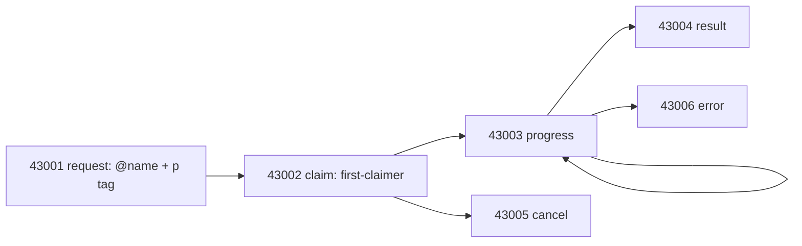

## Channels (plane S)

A channel is the room. Creation and closing are kind 39000 (`h`/`d` identifies the channel); membership is kind 39002 with `p` mention tags; posts are kind 9, one line each.

```bash
toron channel create steer-bd-z2d0 --name "steer bd-z2d0" --project <slug> --as <Pin>
toron channel join steer-bd-z2d0 --project <slug> --as <Pin>
toron channel post steer-bd-z2d0 --project <slug> --as <Pin> \
  --mention <Peer> --body "handing off crates/x/src/**"
toron channel read steer-bd-z2d0 --project <slug> --as <Pin> --author <Peer>
toron channel close steer-bd-z2d0 --project <slug> --as <Pin>   # creator-only tombstone
toron channel purge steer-bd-z2d0 --project <slug> --as <Pin>   # creator/operator, closed only, audited
```

Every verb is `<ID> --project <slug> --as <Pin>`, with `--name` required on create
and `--body` (or `--file`) required on post. The ID is the `h` tag; the name is
display only.

```text
$ toron channel list --project toron
[
  {
    "closed": false,
    "creator": "4afd4b6a1e6c1ed69ee1396721b63434138484f12d9ea73a4acd233eed8f928a",
    "id": "steer-adr35",
    "members": [
      "aea0b8be1269f506beef935b11184f26e3a4aa8e9827c7ce6fc644945eaa547c",
      "94174438fbf9ed3eed6ae234a796559cb96899d02586a28c81b5e12bb7e6f4f3"
    ],
    "name": "steer-adr35",
    "private": false,
    "project": "toron"
  }
]

$ toron channel read steer-adr35 --project toron --as QuietHarbor
[]
```

Members are listed as npubs, not pins, and this read returned nothing: the
reader is not among the members above. A channel read is membership-scoped, so an
empty array is "nothing here for you", which is different from a failure.

If it fails: a post from a non-member fails loud with no event id and names
`channel join` as the remedy — join first, or spawn with `--join-channel`. A post
that tripped the 4096-character cap reports the cap rather than truncating;
use `--file` for a long report and let it chunk into an (1/N) thread. `--wait-ack
&lt;secs>` is what turns "publish" into "observed": without it you have claimed
delivery, not verified it.

Lifecycle: open, then closed, then purged. Closed channels refuse posts and joins and hide from `list` (`--all` shows them); the creator may leave a closed channel. Purge removes a closed channel's bus events.

Rules worth memorizing:

- Posts cap at 4096 characters; over-cap fails loud. `channel post --file <path>` chunks a long report into an (1/N) thread at 700 characters per post.
- `--wait-ack <secs>` verifies delivery and exits nonzero if the event never lands. One read-back after every load-bearing post.
- "Did X report?" is one query: `channel read --author <pin>` returns `delivered_posts == 0` when they did not.
- Reads are newest-first (descending created_at).
- Join-before-post: a non-member post fails loud with no event id, and the error names `channel join` as the remedy. Spawn with `--join-channel` to pre-join crews.
- Never gift-wrap a room post. Rooms are plaintext by design.

## Jobs (plane J)

Kinds 43001-43006, first-claimer wins, semaphore plus one-in-flight-per-agent.



An `@Name` in the body plus `--mention Name` (which sets the `p` tag) creates the job. A missing `p` tag is no job. Claim through `toron job claim`; never fake a 43002 with raw events:

```text
$ toron job list --project toron
[]
```

The lifecycle verbs need more than the job id: `job claim|progress|result|error|cancel`
all take `<JOB_ID> --project <slug> --as <Pin>`, and `progress`, `result` and
`error` additionally require `--body <BODY>` (`--status <STATUS>` on result,
`--message <MESSAGE>` on error).

If it fails: `[]` is the honest state of a project with no open jobs, not a
broken read — job requests live on the bus and expire, so an empty list is what a
quiet project looks like. A claim on a job someone else already claimed reports
the first claimer rather than stealing it.

## Crew steering (no captain in the hot path)

1. A: `channel create steer-<bead>` (private). B: `channel join`.
2. A: `channel post --mention B` (mention in body and `p` tag).
3. B: `watch --once`, then `job claim`, then work. Reserve paths first; no worktrees.
4. B: `job result` + `channel post` done. A: `job show`.
5. Optional: A: `react :+1:` to fire `reaction_added` workflows.

On claim, mail `starting`. On close, mail `[{id}] done` on the bead thread. Peer handoffs skip the captain entirely; file overlap is a reservation, not a DM.
