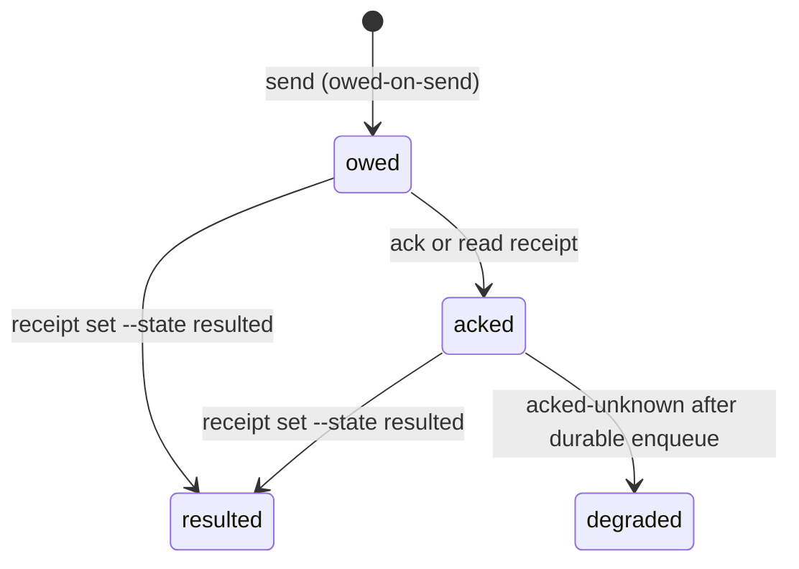

## Sending

```bash
toron mail send --project <slug> --as <Pin> --to captain \
  --subject "[bd-z2d0] done" --body "<REPORT>" --thread bd-z2d0 \
  --corr <corr> --wake tasked --result-path docs/guides/REPORT.md
```

```text
$ toron mail send --project toron --as QuietHarbor --to captain \
    --subject "[bd-f5g1] starting" --thread bd-f5g1 --body "claiming bd-f5g1"
{
  "count": 1,
  "deliveries": [
    {
      "payload": {
        "event_id": "579eaaa63d5cead14aaa15ffdf8470e96994d71157e0e487140c5b85d1e13e1f",
        "recipient": "SwiftHeron"
      },
      "project": "toron"
    }
  ],
  "verified_sender": true
}
```

`count` is deliveries written, and `recipient` is the pin the alias resolved to
(`captain` is a name, not a mailbox). `verified_sender` means the event was
signed by the key `--as` names — a send that reports `verified_sender: false`
is a failure even when it printed an event id.

| Flag | Semantics |
|---|---|
| `--thread` | Thread key. For work, always the bead id. |
| `--corr` | Correlation id. The sender mints it; the thread id is never the corr (conflation fails loud). |
| `--wake <kind>` | Wake hint riding `extra_tags` on rumor 14, never the encrypted 1059 envelope. |
| `--priority` | Normal or low ordering. |
| `--audience` | Audience narrowing tag. |
| `--result-path` | Where the deliverable landed; pairs with the file-first rule. |
| `--verdict approve\|deny` | Closes exactly one human decision per corr (ADR-0028 E4). |
| `--importance urgent` | Outer urgency tag, visible without decrypting, injected immediately. Spend it on file-conflict blocks, unanswered request-releases, wedges. Never on status or FYI. |
| `--resolve-bead <bead>` | Stamps the structural done-hold tag the flywheel dispatch guard matches (CLI-only; the guard matches the tag, not a subject line). |

Recipients are explicit: `reply_message` does not default to the sender (the flywheel facade fills the parent sender when omitted). `mail ack` and `mark_message_read` take the hex `message_id`, never an integer.

## Receiving

```bash
toron mail inbox --project <slug> --as <Pin> --since last   # read + atomic high-water bump
toron mail inbox --project <slug> --as <Pin> --since_ts 2026-09-10T00:00:00Z
toron mail search --project <slug> --query "<fts query>"    # query is a flag, not a positional
toron mail thread-summarize --project <slug> --thread <thread-id>
toron mail whois <project> <name>
```

```text
$ toron mail inbox --project toron --as QuietHarbor --since last
{
  "messages": []
}

$ toron mail thread-summarize --project toron --thread bd-f5g1
{
  "action_items": [],
  "key_points": [ "[bd-f5g1] starting" ],
  "message_count": 1,
  "participants": [ "QuietHarbor" ],
  "thread_id": "bd-f5g1"
}

$ toron mail whois toron QuietHarbor
{
  "last_active_ts_us": 1790378966000000,
  "model": "flywheel",
  "name": "QuietHarbor",
  "npub": "86112aa8bacf5a7f0ab94e113dff52fc47108b7293638f19d756d835bf3b26a8",
  "pane_id": "wK:p2",
  "program": "flywheel",
  "stale": false,
  "workspace_id": "wK"
}
```

An empty `messages` array is the healthy resting state, not a failure: nothing
arrived since the cursor. `stale: false` on a whois is what makes a pin a live
addressee rather than a name that resolves to nobody.

If it fails: `error: no cursor for --since last` means this identity never read
this project before — run one `--since_ts` read first, or accept the first read
as read-everything. A whois for an unknown name fails fast rather than
guessing; `mail search` with a bare query string fails with
`unexpected argument`, because the query is `--query` and the flag order is
`--query` then `--project`.

`unread_only` is accepted everywhere and ignored. `since_ts` must be RFC3339; a unix integer errors rather than being silently misread. Act on `importance high|urgent` first. MCP `fetch_inbox` takes `agent_name`, `project_key`, optional `since_ts` (RFC3339), `include_bodies`, `limit`, `urgent_only`, `ack_overdue_only`, `thread_id`.

## Receipts

Every send owes a receipt. The store is durable SQLite with `corr` as primary key, next to `message_reads` and `inbox_cursors`, and the state machine is monotonic: never downgrades.



`degraded` means the answer path was lost after a durable enqueue. It is never resend-inviting: a duplicate beats silence. Transitions: `owed -> acked` happens in `send_receipt` (acks and reads); `resulted` is explicit via `toron receipt set --corr <id> --state resulted [--result-path <p>]`.

```bash
toron receipt get --corr <id>
toron receipt list --state owed
toron wait --corr <id> --project <slug>   # subscribe-until-receipt; TTL-bounded
```

```text
$ toron receipt list --state owed
toron: error: migrate: migration 13 is applied in <data-dir>/index.sqlite but this toron build resolves at most 12, so this binary is older than the store. Fix: rebuild or upgrade toron from the source that wrote the store (cargo install --path crates/toron-cli), or point --data-dir at a store this binary can open.
```

That is not a documentation error and not an empty result: the store has
migration 13 applied and this binary resolves only 12, so the receipt store
refuses to open. The refusal names the store, the missing version, the highest
version this build resolves, and the repair. Run a binary built from this
checkout (or upgrade the installed one). A receipt read is the first thing to
notice, because that store is the only one with its own migration set.

If it fails: an empty receipt list for a corr you just sent means the send never
enqueued a receipt, which is a send-side failure worth reporting rather than
re-sending on. `wait` returning the wedge pattern instead of a receipt is also a
signal to escalate; it expires on purpose rather than dropping the question.

`wait` expiry escalates as a wedge pattern instead of dropping silently, and the digest renders earliest-deadline first. Cron and timers are message producers; there is no separate wake kind.

## Required args (MCP parity)

- `send_message`: `sender_name`, `to` (array), `subject`, `body_md`, `project_key`; optional `thread_id`, `topic`, `importance`, `ack_required`.
- `reply_message`: same required set; pass `thread_id` to stay in-thread.
- `acknowledge_message` / `mark_message_read`: `agent_name`, `project_key`, `message_id` (hex string).

Nothing pushes. The rhythm is: poll `--since last` per work unit, or let the flywheel doorbell collapse `watch --live` plus inbox into one `[doorbell]` line.
