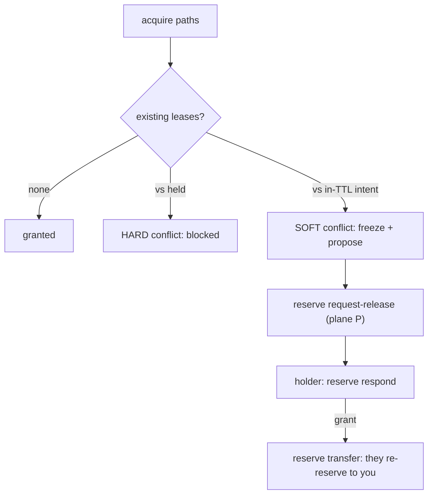

## File reservations

Reserve paths before editing. A reservation (kind 30031) has three states: `intent` (plan to edit, roughly a 5-minute TTL), `held` (the live lease; the default state of an acquisition), `released`.

```bash
toron reserve acquire --project <slug> --as <Pin> --paths 'crates/x/src/**' --reason bd-z2d0
toron reserve conflicts --project <slug> --as <Pin> --paths 'crates/x/src/**'
toron reserve renew --project <slug> --as <Pin> --paths 'crates/x/src/**' --extend-secs 600
toron reserve release --project <slug> --as <Pin>
```

```text
$ toron reserve acquire --project toron --as QuietHarbor \
    --paths 'docs/guides/*,docs/guides/**/*' --reason bd-f5g1
{
  "conflicts": [],
  "reservations": [
    { "exclusive": false,
      "expires_ts_us": 1798155045000000,
      "id": "fc70c49b609083f3ba043fb5060f445a022e6aaa6638104f1732a35f7128d08a",
      "path_pattern": "docs/guides/*",
      "reason": "bd-f5g1" }
  ],
  "soft_conflicts": []
}

$ toron reserve conflicts --project toron --as QuietHarbor --paths 'docs/guides/*'
{
  "checked_paths": 1,
  "clear_paths": [ "docs/guides/*" ],
  "conflict_free": true,
  "conflicts": [],
  "has_soft_conflicts": false,
  "total_conflicting_reservations": 0
}
```

One flag, comma-separated globs. `expires_ts_us` is the absolute lease expiry,
so `renew` extends that number rather than stamping `now + ttl`.

If it fails: `error: the following required arguments were not provided:
--as &lt;AGENT>` on `reserve conflicts` is the read's caller identity, which a
held-lease check needs to separate "mine" from "yours". A zero-file-match
acquire warns rather than failing, which is how a glob typo (`crates/x/src/*`
instead of `**/*`) turns into an unguarded commit much later.

`--paths` takes one glob per flag; repeat the flag for multiple paths. `--reason` is the bead id, always: release-on-bead-close keys off it (`release_file_reservations_by_reason`, operator/loop; crews use `release_file_reservations`).

Two board verbs close the loop when a bead closes or a lane needs to see holders:

```bash
# The active lease board the strict guard evaluates (holder, path, reason, expiry).
toron reserve list --project <slug> [--holder <Pin>] [--path 'crates/x/src/**']
# Release-on-bead-close: revoke every lease whose reason is the bead id.
toron reserve release-by-reason bd-z2d0 --project <slug> --as <Pin>
```

```text
$ toron reserve list --project toron
{
  "count": 6,
  "project_key": "toron",
  "reservations": [
    { "holder": "BrashOtter", "path": "docs/notes/2026-09-26-run-state-checkpoint-design.md",
      "reason": "bd-langgraph-b2b3-spec", "expires_ts_us": 1798151492000000 },
    { "holder": "QuietHarbor", "path": "docs/guides/*",
      "reason": "bd-f5g1", "expires_ts_us": 1798155045000000 }
  ]
}

$ toron reserve release-by-reason bd-f5g1 --project toron --as QuietHarbor
{
  "leases": [
    { "holder": "QuietHarbor", "mode": "shared", "path": "docs/guides/*" }
  ]
}
```

The last line is the whole contract: the response **is** the list of revoked
leases, and the holder's board is empty afterwards (captured live — the rows came
back as `count: 0`, and the re-acquire is what this guide's screenshots were
taken under).

If it fails: `release-by-reason` with an empty `leases` array is a clean no-op,
not an error — the bead closed and nothing was held under it. Do not "fix" that
by releasing with a path glob instead: a glob release widens to whatever the
pattern matches, while the reason form is keyed to exactly one bead.

`reserve list` is read-only and filters by exact holder and/or symmetric-glob path overlap. `release-by-reason` is operator-signed (no staleness heuristic: the closed bead IS the evidence) and exits with `released: 0` as a clean no-op when nothing matches. Neither adds an MCP tool; both drive the existing `list_file_reservations` / `release_file_reservations_by_reason` operators.

## Conflicts



- Acquire against a **held** lease is a hard conflict: blocked.
- Acquire against an in-TTL **intent** is a soft conflict: freeze and propose.
- `reserve conflicts` reports both classes.
- Force-release addresses a path (plus optional holder), never an event id: `force-release` or `flywheel mail force-unlock <project> --paths <path> [--holder <name>]`.
- Never commit on behalf of someone else. A grant is a `transfer` of the lease, not a favor.
- `renew` extends the stored absolute expiry; recomputing from now is a bug.
- The don't-sweep request is a **guard**, not a DM: `guard install|uninstall` puts the pre-commit hook in the repo (it never clobbers a user hook, and `TORON_GUARD_STRICT=0` is operator-only).
- The strict guard evaluates the **git index**, not a `git commit -- <pathspec>` selection. A staged file outside the pathspec you commit still counts, so it can block you (`.beads/issues.jsonl` and the other `.beads` bookkeeping files are shared-safe and exempt). Unstage what you are not committing, or reserve it.

Mechanics worth knowing: leases are kind-30031 addressable events (`d`=`project:path-glob`, NIP-40 expiration, dual-emit scoping), and conflicts are symmetric fnmatch both ways. Force-release is never a NIP-09 delete: the operator signs a kind-30031 `status:revoked` event at the same `(kind, d)` coordinate, and the projection resolves it by key-priority `operator > agent`. An acquire against the declarer's own intent converts intent to held at the same coordinate (must-convert). Status-less 30031s read as `held` for backward compatibility.

## Build slots

Build slots (kind 30032) serialize heavy builds across agents and crews:

```bash
toron slot acquire --slot cargo --project <slug> --as <Pin>
mbx +nightly-aarch64-apple-darwin test
toron slot release --slot cargo --project <slug> --as <Pin>
```

```text
$ toron slot acquire --slot doc-capture --project toron --as QuietHarbor
{
  "conflicts": [],
  "granted": [
    { "exclusive": false, "expires_ts_us": 1798155165000000, "slot": "doc-capture" }
  ]
}

$ toron slot renew --slot doc-capture --extend-secs 300 --project toron --as QuietHarbor
{
  "slot": { "agent_name": "QuietHarbor", "exclusive": false,
            "expires_ts_us": 1798155465000000, "slot": "doc-capture", "status": "active" }
}

$ toron slot release --slot doc-capture --project toron --as QuietHarbor
{
  "released": true
}
```

`--slot <NAME>` is the shape, not a positional: `toron slot acquire cargo` fails
with `unexpected argument 'cargo'`, and `renew` additionally requires
`--extend-secs`. A slot is just a name, so capture on a name no lane builds
under if you are only checking how the lease behaves.

Acquire slot `cargo` before any `mbx ... test`. Slots work without `WORKTREES_ENABLED`. Advisory by default; `--exclusive` when a lane cannot tolerate a neighbor build.

If it fails: `conflicts` is only ever populated on a refusal — a granted row and
an empty conflict list is the normal case, and two granters cannot both hold an
exclusive slot. A release that reports `released: false` means the lease had
already expired; nothing is held, so there is nothing left to repair.
