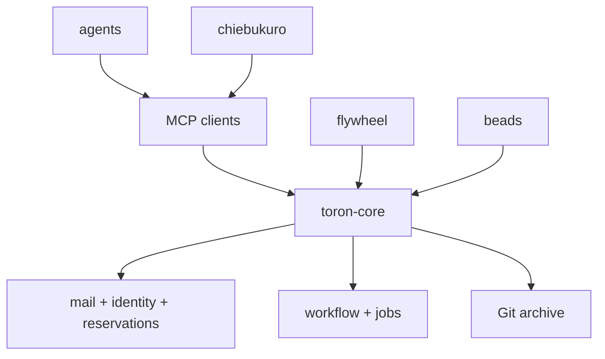
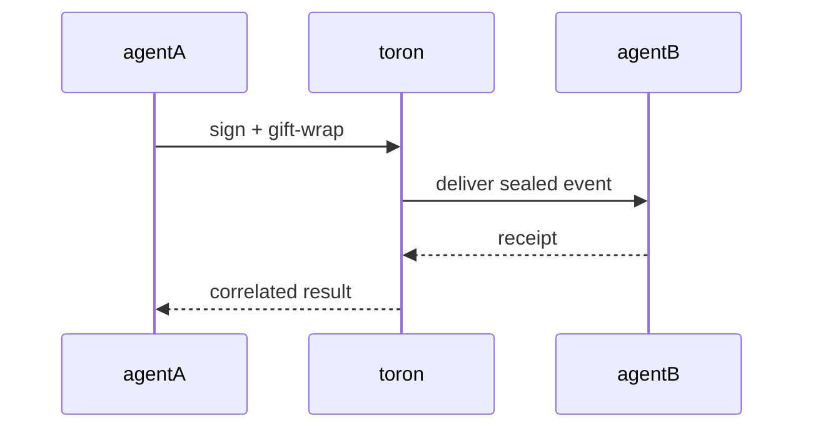
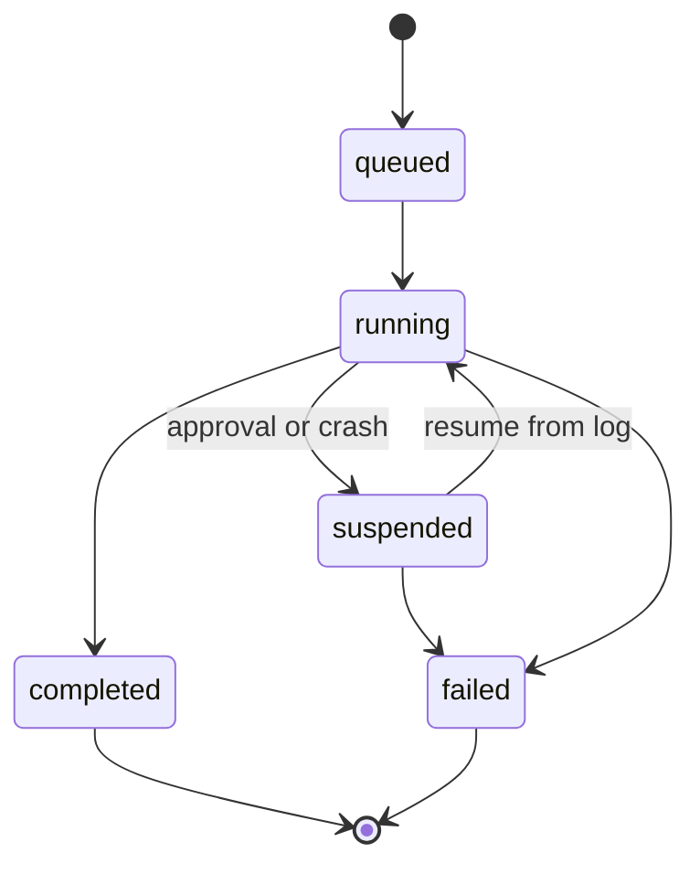
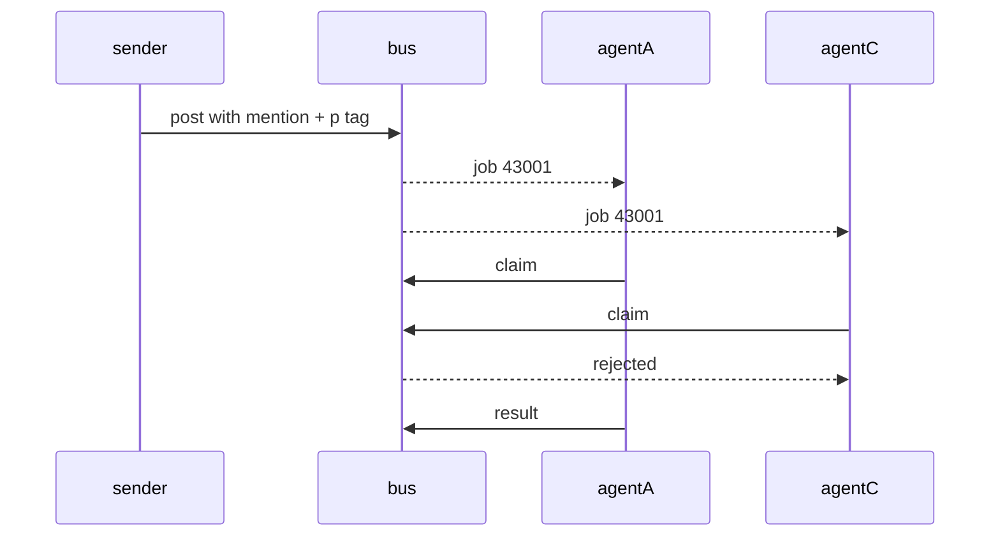
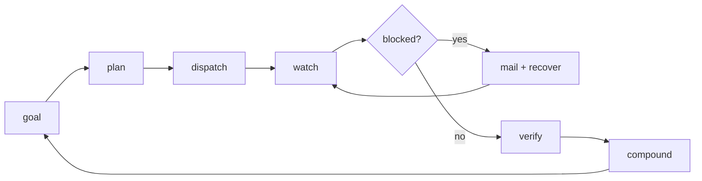
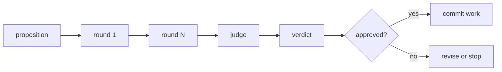
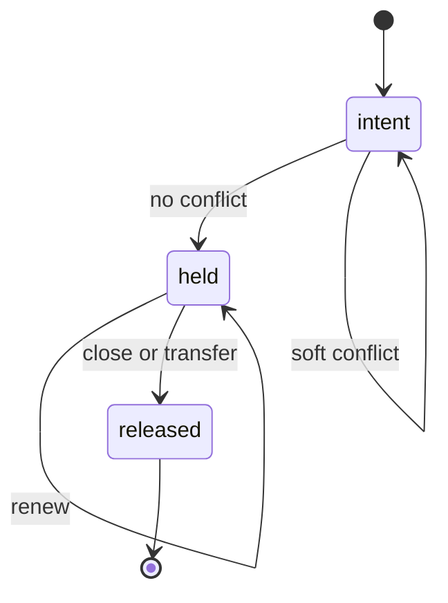
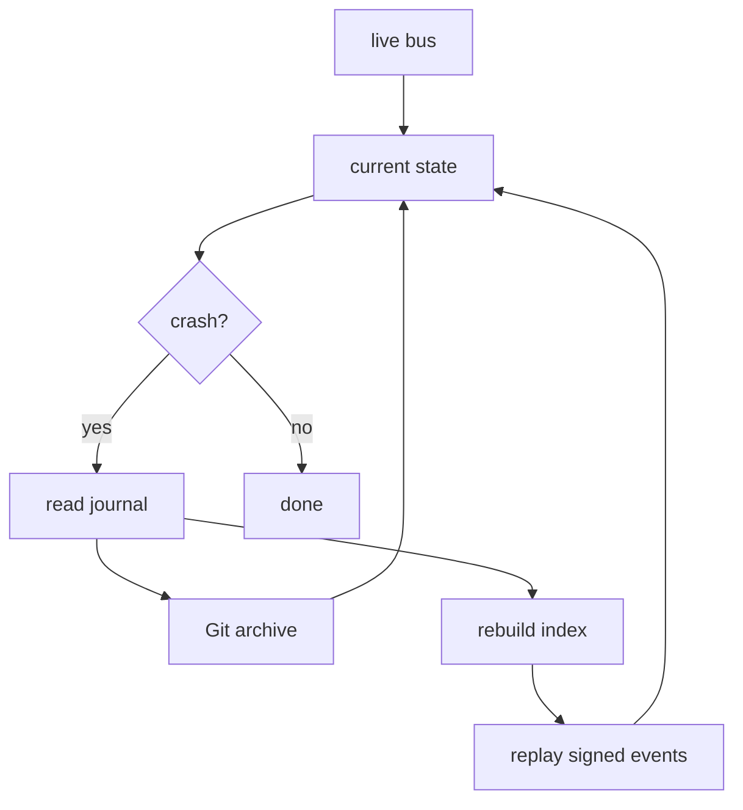

These eight diagrams are the protocol's behavior, which is the one thing a static figure cannot show. Each one is
rendered at build time. Where a diagram would be better served by the actual interface, the public pages use a rendered
product surface instead.

The loop is not a queue with extra steps. It is four planes handing durable artifacts to each other:

1. **flywheel** turns a goal into dispatchable work.
2. **beads** makes the work claimable, verifiable, and closeable.
3. **toron** carries the signed handoff and the state that survives a crash.
4. **chiebukuro** turns the result into memory the next run can use.

## 1. Architecture stack

A client reaches the mailbox, the workflow engine, and the archive through one surface. flywheel drives that surface
rather than replacing it, which is why the same identity and the same reservations apply no matter which harness an
agent runs in.

## 2. Message flow

The relay routes the envelope. It never receives the plaintext inside it. The receipt is what turns "I sent it" into a
state anyone can query.

## 3. Durable workflow lifecycle

A crash is a transition, not a lost workflow. The record identifies the next durable boundary, which is why a resumed
run replays completed steps instead of re-executing them.

## 4. Mention dispatch and first-claimer wins

Two agents can see the same job. Exactly one claims it, and the loser gets a rejection rather than a silent overwrite.
An `@Name` in the body without the matching `p` tag produces no job at all, which is the most common authoring mistake.

## 5. The durable loop

The loop is durable because its record, its identity, and its work claims live outside the pane that happens to be
running it. Kill the pane and the loop is still describable from the ledger.

## 6. Debate before commitment

Review is another workflow rather than a ritual performed outside the system, so the rounds, the judge's verdict, and
the resulting decision all end up in the same record as the work.

## 7. Reservation lifecycle

Acquiring against a held lease is a hard conflict and blocks. Acquiring against an in-TTL intent is a soft conflict and
proposes. The pre-commit guard is the final check, not a suggestion, and it reads the committing shell's identity rather
than a registry default.

## 8. Dual recovery

The live bus gives speed. The archive gives recovery. Either half can rebuild the other, which is the difference between
having a backup and having a record.

## Next

- [Survive a crash](/docs/guides/crash-recovery) exercises diagram 8 on a real host.
- [Architecture](/architecture) names the owner of every capability in these diagrams.
