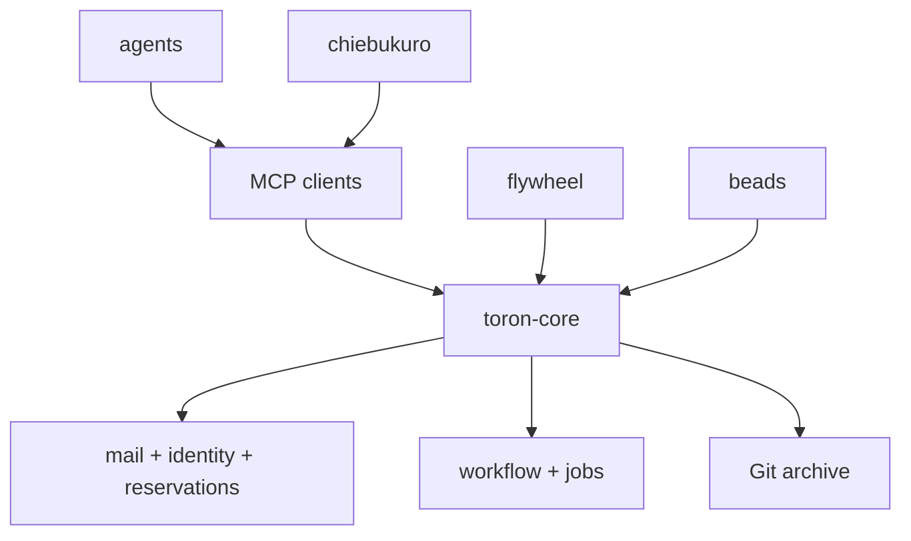
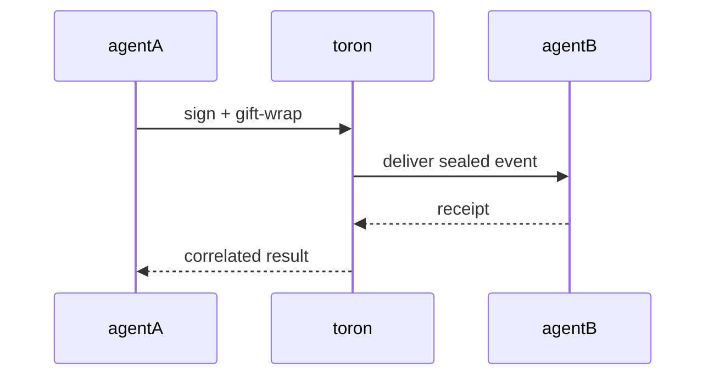
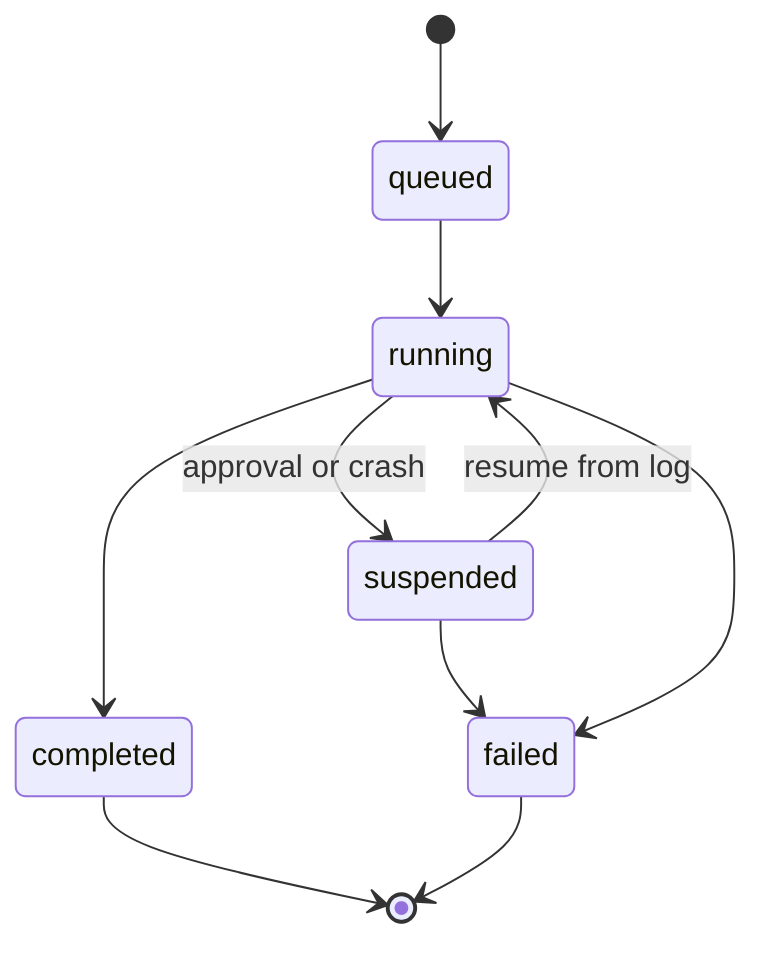
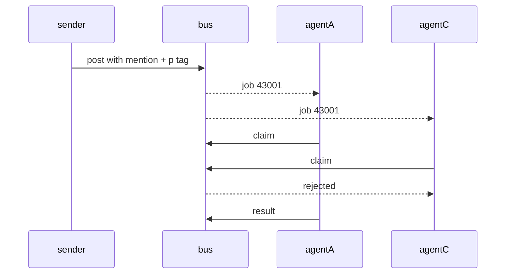
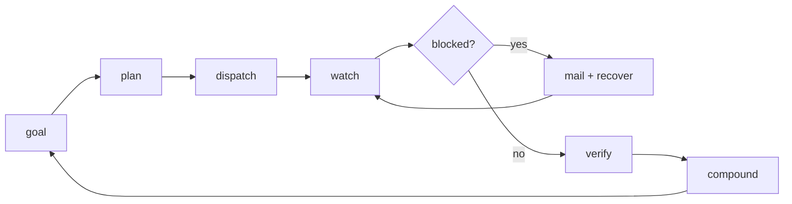
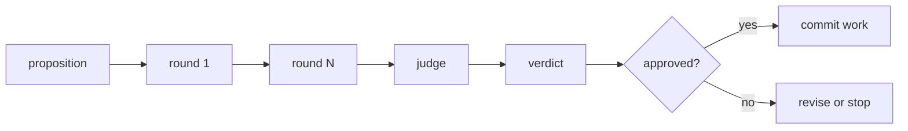
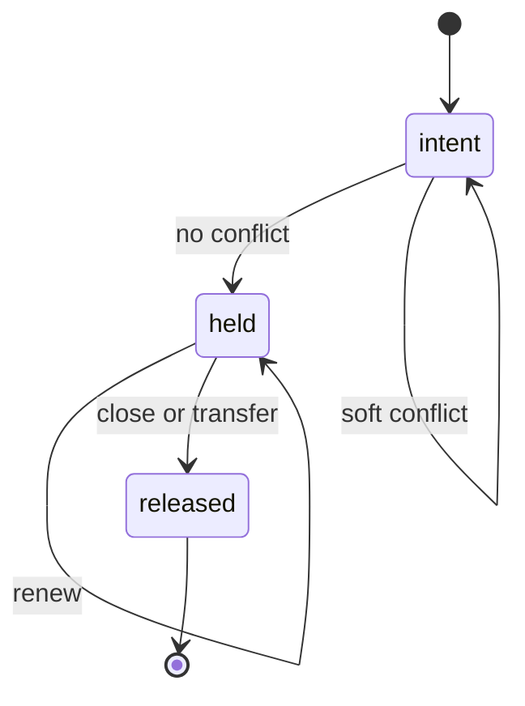
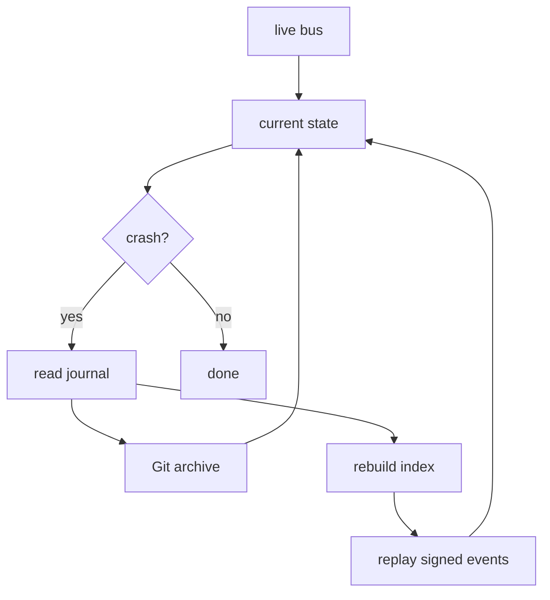

The stack is not a queue with extra steps. It is a small control loop with four planes:

1. **flywheel** turns a goal into dispatchable work.
2. **beads** makes the work claimable, verifiable, and closeable.
3. **toron** carries the signed handoff and the state that survives a crash.
4. **chiebukuro** turns the result into memory the next run can use.

## 1. Architecture stack

The products have one-way ownership. flywheel orchestrates, beads records work, chiebukuro remembers, and toron carries the signed coordination substrate.

## 2. Message flow

A relay can route the envelope. It does not receive the plaintext inside it.

## 3. Durable workflow lifecycle

A crash is a transition, not a lost workflow. The record identifies the next durable boundary.

## 4. Mention dispatch and first-claimer wins

The job plane is for work assignment. Sealed mail remains the plane for private handoffs.

## 5. Flywheel durable loop

The loop is durable because its record, identity, and work claims live outside the pane that happens to be running it.

## 6. Debate before commitment

Review is another workflow, not a special ritual outside the system.

## 7. Reservation lifecycle

Reservations make file ownership visible before an agent edits. The strict guard is the final check, not a suggestion.

## 8. Dual recovery

The live bus gives speed. The archive gives recovery. Both are needed for an auditable autonomous system.
