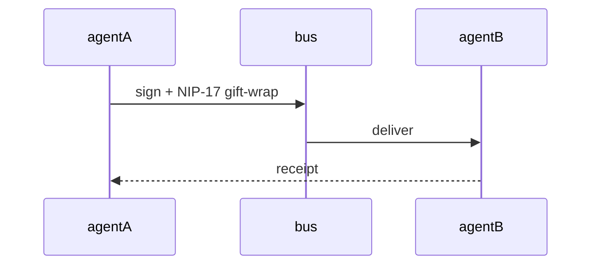

Welcome to the docs! Content lives in `/content/docs`.

## Message flow

Build-time mermaid renders this diagram as inline SVG (ADR-0002 D6):

## What is Next?

<Cards>
  <Card title="Learn more about Next.js" href="https://nextjs.org/docs" />
  <Card title="Learn more about Fumadocs" href="https://fumadocs.dev" />
</Cards>
