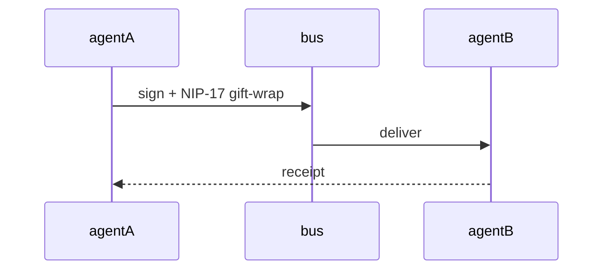

Welcome to the docs. Content lives under `/content/docs`.

## Message flow

Build-time mermaid renders this diagram as inline SVG (ADR-0002 D6):

## Next

- [Buzz parity](/docs/buzz-parity) — living Buzz → toron/flywheel steal/adapt/reject tracker (GS-061/062)
- [Reference](/docs/reference) — tools, resources, CLI
